# [Badbyte][1]
Infiltrate BadByte and help us to take over root.

### [Task 2] Reconnaissance

In this task:

- First scan which ports are open on the box: `nmap -p-  -vv MACHINE_IP`
- Then after finding the ports number, enumerate what services are running on those port: `nmap -A -p port1,port2,port3 MACHINE_IP`

> If you are unsure how to tackle this, I recommend checking out the [Nmap Tutorials by Hack Hunt][2].

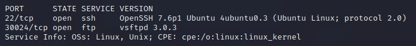

These questions can be answered using the above results.

### [Task 3] Foothold

 Hmm, crack the passpharse, but where is it? I think the creator forgot to give us the link?!

 Oops! There is a `FTP` port open, lets check that. Connect to the machine using `ftp <IP> 30024` with credentials `anonymous:anonymous`

 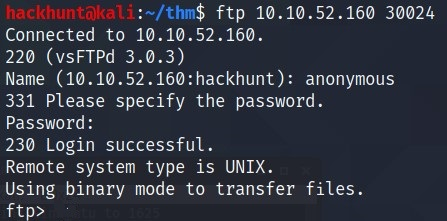

 Check what files do we have here!

 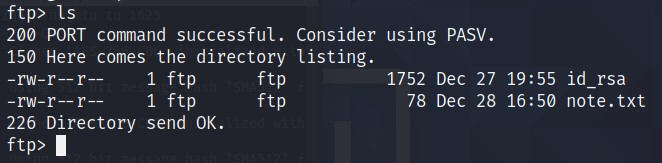
> Ohhh! the creator was talking about this `note.txt`. There is one more file, seems like `private_key` for ssh connection. SWEET!

Use `get` command to get those two files. Syntax is `get <source> <destination>`.

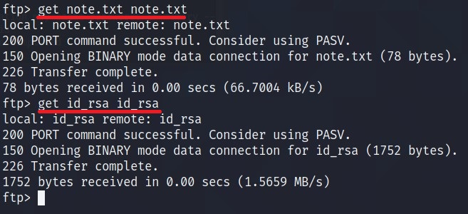

Now that we have the file, let's first check the content of the `note.txt`

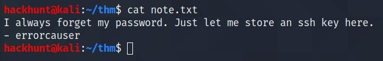
> Seems like we have a user `errorcauser`. Well thanks for forgetting your password and keeping a copy here.

As the `port 22` is open. Let's connect via `ssh`.

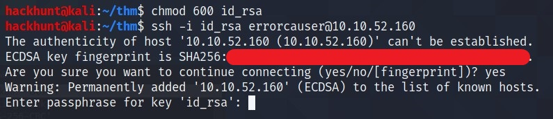
> Seems like, it needs a password :cry:

JohnTheRipper to RESCUE.
1. Convert `id_rsa` into `hash` using -> `python3 /usr/share/john/ssh2john.py id_rsa > hash`
2. `john hash -w=rockyou.txt`

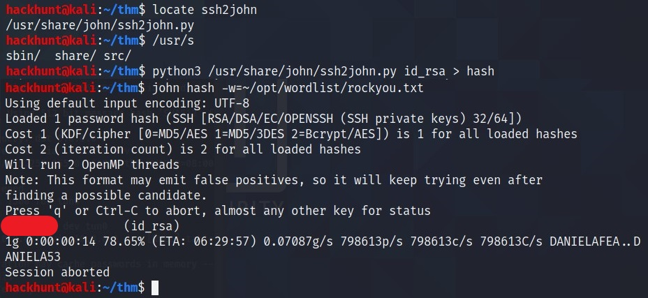

Seems like we have a password. Let's connect.

*What username do we find during the enumeration process?*
> ***errorcauser***

*What is the passphrase for the RSA private key?*
> Result from JohnTheRipper.

### [Task 4]  Port Forwarding

First add the `socks4 127.0.0.1 9050`, if it is not already in `/etc/proxychains.conf`

Dynamic Port Forwarding can be setup using :
`ssh -D 9050 errorcauser@<IP> -i id_rsa`

Fireup another terminal and scan the machine using `nmap`. This can be achieved using: `sudo proxychains nmap -sT -Pn localhost`.

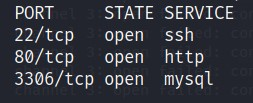

These questions can be answered using above scan result.

Local Port forwarding can be done using: `sudo ssh -i id_rsa -N -L 8080:127.0.0.1:80 errorcauser@<IP>`

### [TASK 5] Web Exploitation

Let's go to `localhost:8080`. It a good looking website.

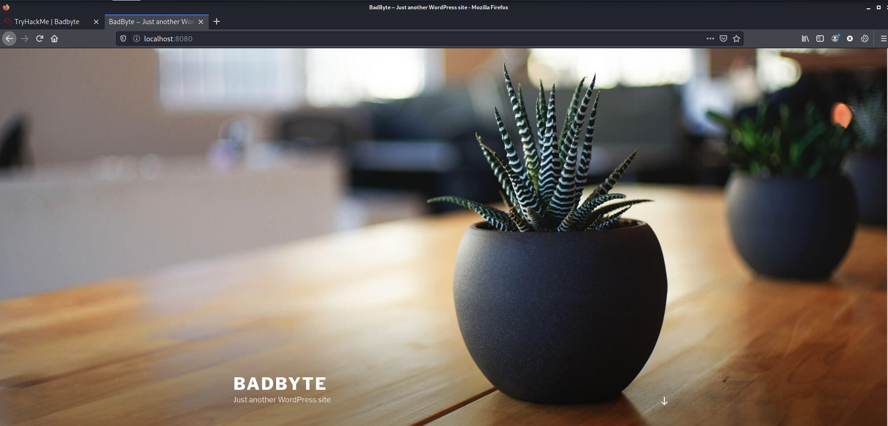

To know about CMS and what it is, check this [Reference][3].

*What CMS is running on the machine?*
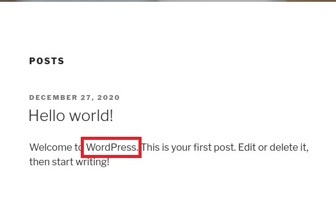
> Check the first post and its seems like its ***WordPress***.

To get the plugins, I use `gobuster` to enumerate for valid plugins. In wordpress, plugins are in directory `/wp-content/plugins/` and there is a very good plugins wordlist -> `usr/share/metasploit-framework/data/wordlists/wp-plugins.txt`

CMD -> `gobuster dir -u http://127.0.0.1:8080/wp-content-plugins/ -w usr/share/metasploit-framework/data/wordlists/wp-plugins.txt`

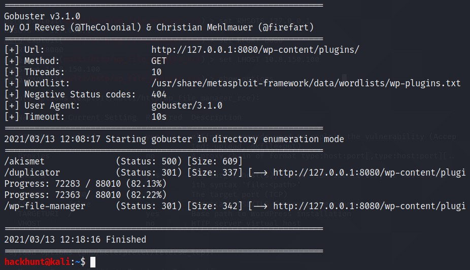

We have three plugins:
- akismet
- duplicator
- wp-file-manager

You can get the version by `http://localhost:8080/wp-content/plugins/<plugin_name>/readme.txt`

To know more about the enumeration for WordPress, I used this [Reference][4].

*What is the CVE number for directory traversal vulnerability?*
> Go to [CVE Mitre][5] website and search for `wordpress duplicator`. You will get the CVE number. Make sure to check the HINTS for this one.

*What is the CVE number for remote code execution vulnerability?*
> Search for `wordpress wp-file` in `searchsploit`

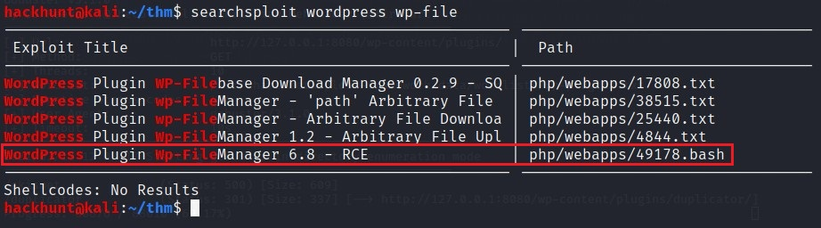
> There is one which can be use for **RCE**.

Check the file using: `cat /usr/share/exploit-db/exploits/php/webapps/49178.bash | head`

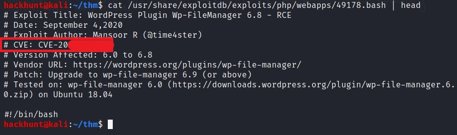

*There is a metasploit module for the exploit. You can use it to get the reverse shell. If you are feeling lucky you can follow any POC( Proof of Concept).*
> Start Metasploit using `msfconsole` and search using `search wordpress wp-file`.

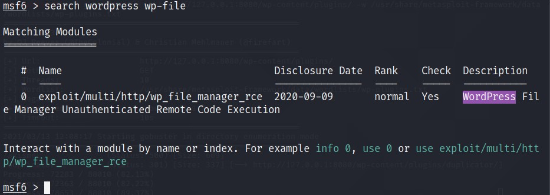

Type `use 0`.

Set all the options like `RHOSTS`, `RPORT` and `LHOST`.

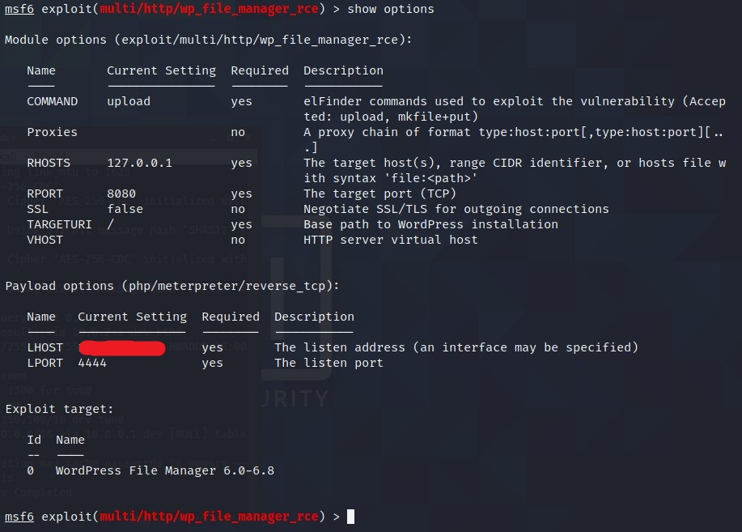

Type, `run` and BAAM got the meterpreter connection.

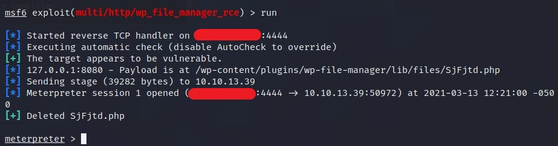

*What is the name of user that was running CMS?*
> Go to `/home` using `cd /home` and do `ls` to get the users.

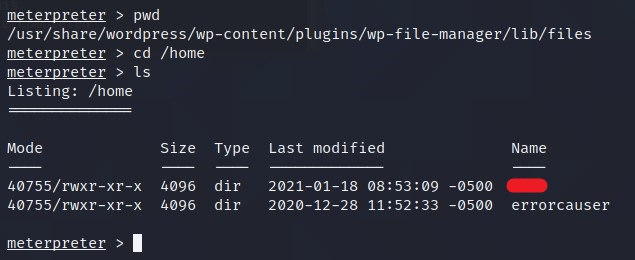

*What is the user flag?*
> Go to the user's directory and type `cat user.txt`.

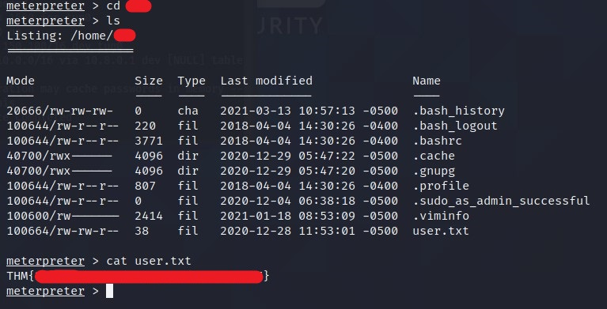

### [Task 6]  Privilege Escalation

LOGGING is ON!

There is `.bash_history` file. Download it using `download .bash_histroy` and check the file. It didn't worked for me.

So I looked around in `/var/log/` directory and found `bash.log`. Read the file using `cat bash_log`

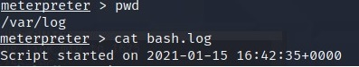

You will get the old password.

*What is the user's new password?*
> Read the description properly and you can guess the new password. I believe in you :grin:

Now we have the password and username. We can connect using `ssh`

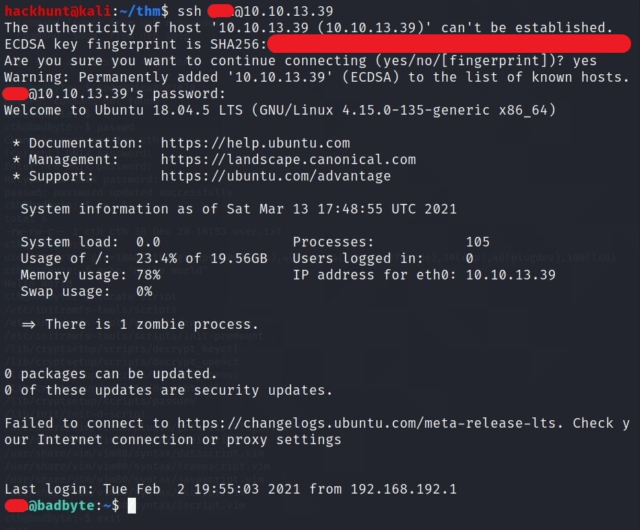

For basic enumeration start with `sudo -l` command or find `SUIDs`.

Or you can use `linpeas.sh`. Send the file using `scp`

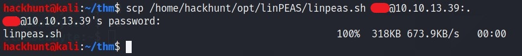
> Run the file by `./linpeas.sh`. This will do all the work for you.

For now I will do it manually, to find SUIDs use `find / -perm -4000 -type f -exec ls -la {} 2>/dev/null \;`

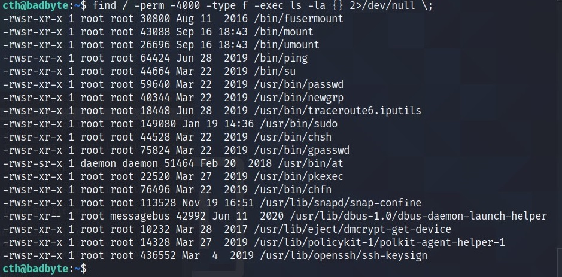

Go to [GTFOBins][6] Website and search the commands.

This can be done using `mount`.
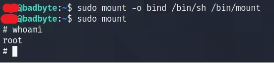

Or `pkexec`

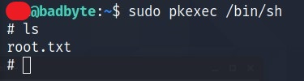

Or simple `su`command

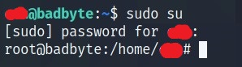

*What is the root flag?*
> You know what to do :stuck_out_tongue_winking_eye:

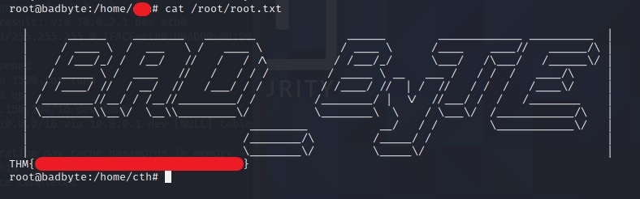

[1]: https://tryhackme.com/room/badbyte
[2]: https://www.hackhunt.in/search/label/Nmap
[3]: https://securitytrails.com/blog/cms-detector
[4]: https://hackertarget.com/attacking-wordpress/#directory-indexing
[5]: https://cve.mitre.org/cve/search_cve_list.html
[6]: https://gtfobins.github.io/
