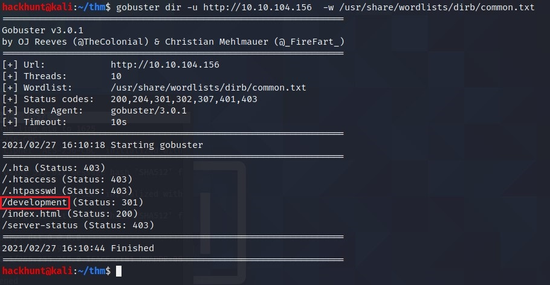
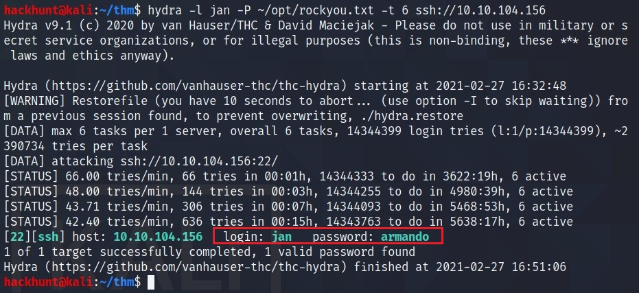
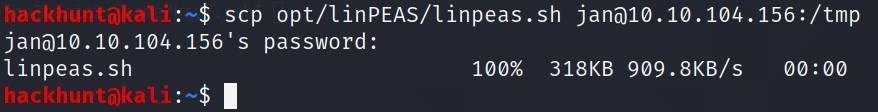
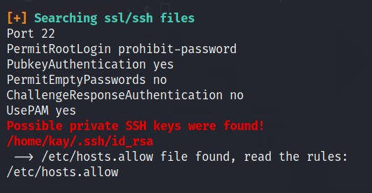
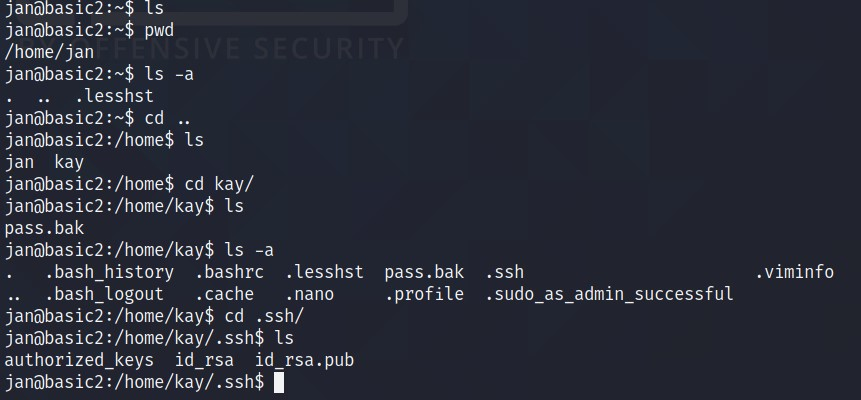
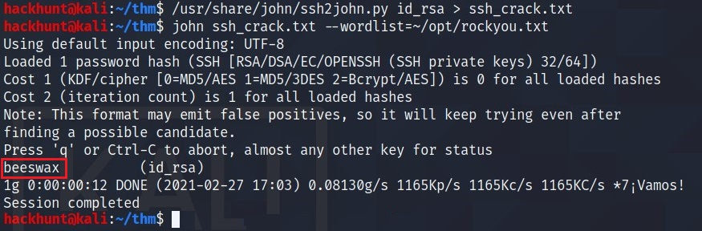
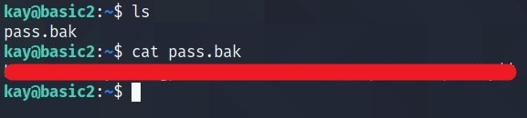

# [Basic Pentesting][1]
This is a machine that allows you to practise web app hacking and privilege escalation

Find the services exposed by the machine
> This can be done using Nmap. Run `sudo nmap -sC -sV -Pn <IP>`. If you are unsure how to tackle this, I recommend checking out the [Nmap Tutorials by Hack Hunt][2].

Check the result for [Nmap Scan][3].

What is the name of the hidden directory on the web server(enter name without /)? **development**
> This can be done using GoBuster. Command: `gobuster dir -u http://<IP> -w /usr/share/wordlists/dirb/common.txt`

Check the file at *\<IP>/development*. Seems like **J** has a week password.

Let's use enum4linux to get more information.
> This can be done using `enum4linux -a <IP>`

Check the results for [enum4linux][4]
> Looks like we got two users ***jan*** and ***kay**

What is the username? **jan**

What is the password? **armando**
> Now we know the username and we know there is a SSH port. We can use Hydra to get the password. Command: `hydra -l <username> -P <wordlist> -t <no._of_threads> ssh://<IP>`

What service do you use to access the server(answer in abbreviation in all caps)? **SSH**
> To connect `ssh jan@<IP>`. Enter the password.

Enumerate the machine to find any vectors for privilege escalation.
> **linPEAS** can be used to enumerate through the machine. You can use *wget* to download a version directly on victim's machine (if *wget* is available).    *(in another Terminal)* Alternatively, if you have a copy on your machine (like I do) `scp` command can be used. Command: `scp <location_of_file jan@<IP>:/tmp`

Redirect to `/tmp` directory. Make *linpeas.sh* executable; `chmod +x linpeas.sh`. Run the file; `./linpeas.sh`.

What is the name of the other user you found(all lower case)? **kay**

If you have found another user, what can you do with this information?
> RED color is in what we are interested in linPEAS results. If you scroll down, you will come across **id_rsa** file i.e. PRIVATE KEY of **kay**

Open the file.

> Do `cat id_rsa`. Copy the content and create a **id_rsa** file on your local machine. Change the permission for the file `chmod 600 id_rsa` (general form for SSH Keys).

When you try to connect using SSH, it needs a passphrase for the private key.

> JohnTheRipper can be used to crack the password. First convert the file using ***ssh2john.py*** and then use ***john*** with ***rockyou.txt*** wordlist.

Now that we have the passphrase for **kay** i.e. **beeswax**. Let's connect.

What is the final password you obtain?
> Read the *pass.bak* file.

[1]: https://tryhackme.com/room/basicpentestingjt
[2]: https://www.hackhunt.in/search/label/Nmap
[3]: https://gist.github.com/abhi-agrawl/2ce8fc1712c2995cdf096ed93a1f960b
[4]: https://gist.github.com/abhi-agrawl/eae55b5bca2df67b9f622c111946bb5f
