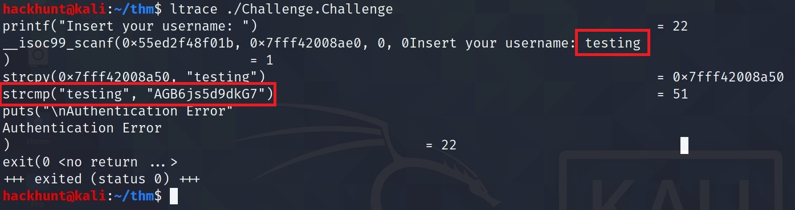
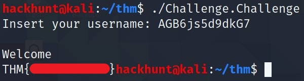

# [Classic Passwd][1]
Practice your skills in reversing and get the flag bypassing the login

This can be done using multiple ways. We will do this using ***ltrace***.

> ltrace, traces the calls to the library function. It executes the program in that process.

Make the **Challenge.Challenge** file executable. `chmod +x Challenge.Challenge`

Command is `ltrace <file_name>`

> Type, anytime when asked for input. Here I typed *testing*. Check before authentication error, the word **testing** is compared with another word using **strcmp** function. So maybe the program is checking the input with the word **AGB6js5d9dkG7** and if they are same, it will print the flag.

Let's check

And BOOM , we got the flag.

[1]: https://tryhackme.com/room/classicpasswd
