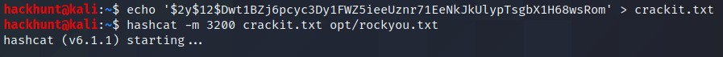
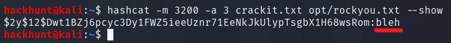
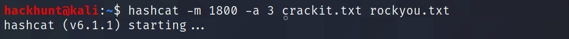
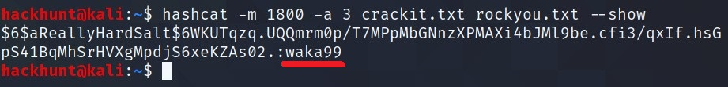
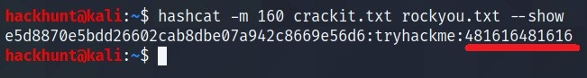

# [Crack the hash][1]

### [TASK 1] Level 1

*48bb6e862e54f2a795ffc4e541caed4d* -> ***easy***
> Paste this hash on the [crackstation][2] website and you will get the result.

*CBFDAC6008F9CAB4083784CBD1874F76618D2A97* -> ***password123***
> [Crack Station][2]

*1C8BFE8F801D79745C4631D09FFF36C82AA37FC4CCE4FC946683D7B336B63032* -> ***letmein***
> [Crack Station][2]

*$2y$12$Dwt1BZj6pcyc3Dy1FWZ5ieeUznr71EeNkJkUlypTsgbX1H68wsRom* ->
> Using [Hash Analyzer][3], it says bcrypt. So we will use [hashcat][5]. `hachcat -m 3200 <has> <wordlist>`

*279412f945939ba78ce0758d3fd83daa* -> ***Eternity22***
> [Crack Station][2]

### [TASK 2] Level 2

*F09EDCB1FCEFC6DFB23DC3505A882655FF77375ED8AA2D1C13F640FCCC2D0C85* -> ***paule***
> [Crack Station][2] or `hashcat -m 1400 <hash> <wordlist>`

*1DFECA0C002AE40B8619ECF94819CC1B* -> ***n63umy8lkf4i***
> [Crack Station][2] or `hashcat -m 1000 <hash> <wordlist>`

*$6$aReallyHardSalt$6WKUTqzq.UQQmrm0p/T7MPpMbGNnzXPMAXi4bJMl9be.cfi3/qxIf.hsGpS41BqMhSrHVXgMpdjS6xeKZAs02* -> ***waka99***

> Hash is sha256crypt. CMD -> `hashcat -m 1800 <hash> <wordlist>`

*e5d8870e5bdd26602cab8dbe07a942c8669e56d6* -> ***481616481616***
> Hash is SHA1 (with salt). We can use `160` mode in [hashcat][5]. Save the file as `hex:salt`. Hashcat CMD -> `hascat -m 160 <hash> <wordlist>`

Alternatively, [John The Ripper][4] can be used. To specify the type use `--format` flag.

[1]: https://tryhackme.com/room/crackthehash
[2]: https://crackstation.net/
[3]: https://www.tunnelsup.com/hash-analyzer/
[4]: https://tools.kali.org/password-attacks/john
[5]: https://hashcat.net/wiki/doku.php?id=example_hashes
