# [CTF collection Vol.1][1]
Sharpening up your CTF skill with the collection. The first volume is designed for beginner.

### [TASK 2] What does the base said?

Can you decode the following?

VEhNe2p1NTdfZDNjMGQzXzdoM19iNDUzfQ==

> Go to [CyberChef][2] website. Paste the code and use `magic` recipe or you can do `echo "VEhNe2p1NTdfZDNjMGQzXzdoM19iNDUzfQ== | base64 -d" `

### [TASK 3] Meta meta

Meta! meta! meta! meta...................................

> You can do `exiftool Findme.jpg` and check the owner section or `strings Findme.jpg | grep THM`

### [TASK 4] Mon, are we going to be okay?

Something is hiding. That's all you need to know.

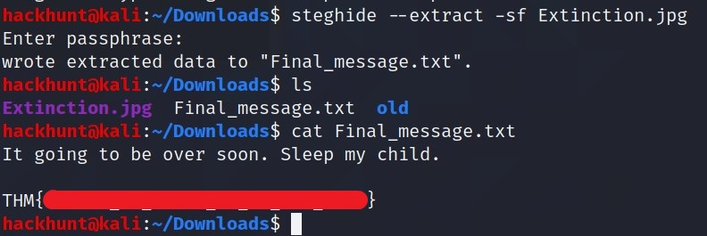
> When Prompt for passphare just press ENTER.

### [TASK 5]  Erm......Magick

Huh, where is the flag? `RIGHT HERE`

### [TASK 6] QRrrrr

Such technology is quite reliable.

> Search for QR Code Decoder and feed the QR image. The one I use is -> https://zxing.org/w/decode.jspx. Upload the image and click on Submit Query.

### [TASK 7] Reverse it or read it?

Both works, it's all up to you.

Create an executable to check what it do.

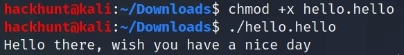

This can be solved using two ways:

1. Using `strings hello.hello | grep THM`

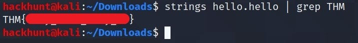

2. Using radare2 -> `r2 -d -A hello.hello` and then `izz | grep THM`

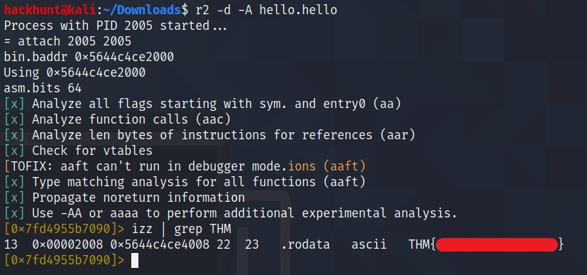

### [TASK 8]  Another decoding stuff

Can you decode it?

3agrSy1CewF9v8ukcSkPSYm3oKUoByUpKG4L

Well! Everyone can solve this by looking it to the HINTS but there is way to solve this without looking to HINTS i.e.

Go to [CyberChef][2] website. Paste the code and use `magic` recipe.

### [TASK 9] Left or right

Left, right, left, right... Rot 13 is too mainstream. Solve this

MAF{atbe_max_vtxltk}

Go to [CyberChef][2] website. Paste the code and use `ROT13` recipe. Gradually increase number and at one point you will get the result.

Or you could look at the HINT, which says its `caesar cipher`. Visit https://www.dcode.fr/caesar-cipher, paste the code and click on `DECRYPT CAESAR CODE` on the left side you will see the results.

### [TASK 10] Make a comment

No downloadable file, no ciphered or encoded text. Huh .......

Right Click and **Inspect the Element**. Explore around and you will get the flag in the same task somewhere.

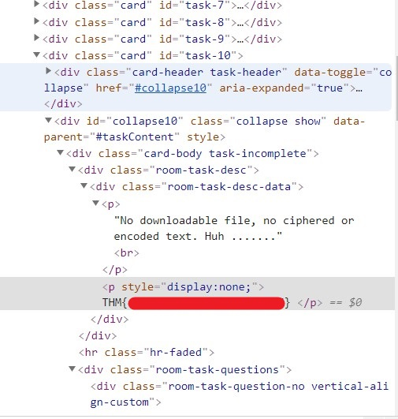

### [TASK 11] Can you fix it?

I accidentally messed up with this PNG file. Can you help me fix it? Thanks, ^^

To fix the file we can use `xxd` command. First is convert the file to `hex` to check the [magic number][3] is present in the beginning or not using `xxd -p spoil.jpg > hexdump`

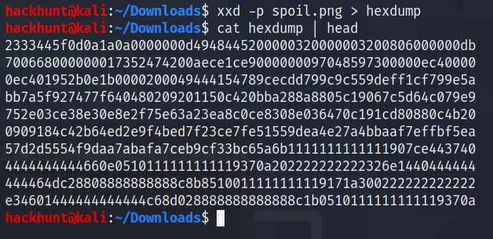
> This is not right the beginning of a PNF file is something with 8. So I checked this [list of HEX Codes][3]. I found that PNG has `89504E47` in the beginning.

So I opened the `hexdump` and added the `89504E47` in the beginning saved it and re complie it using `xxd -r -p hexdump > fixed.jpg`

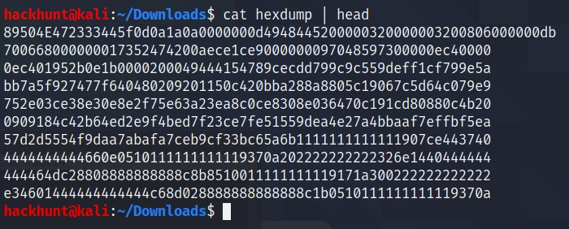
> I checked the file but the file was still not fixed.

So I replaced the eight digits with `89504E47` and re complied it and it worked.

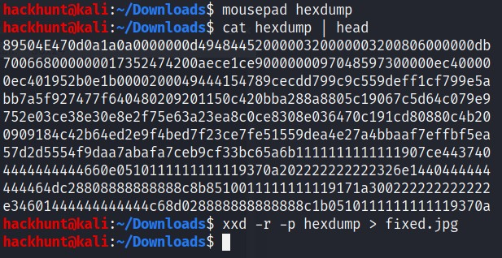

### [TASK 12] Read it

Some hidden flag inside Tryhackme social account.

Search `tryhackme rooms reddit` on Google. Its the first link

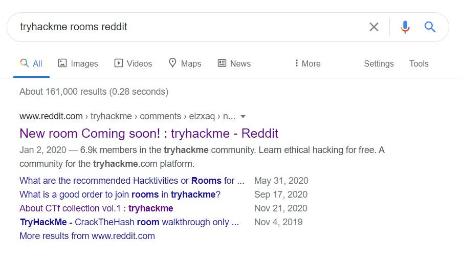

### [TASK 13] Spin my head

What is this?

`++++++++++[>+>+++>+++++++>++++++++++<<<<-]>>>++++++++++++++.------------.+++++.>+++++++++++++++++++++++.<<++++++++++++++++++.>>-------------------.---------.++++++++++++++.++++++++++++.<++++++++++++++++++.+++++++++.<+++.+.>----.>++++.`

Can you decode it?
> Go to [dcode.fr][4] and paste the code > click on EXECUTE and on the left side you will see the results.

### [TASK 14] An exclusive!

Exclusive strings for everyone!

S1: 44585d6b2368737c65252166234f20626d 
S2: 1010101010101010101010101010101010

> Go to [ToolSlick][5]. Paste both the strings without the `S[1-2]: and scroll down you will find the flag in reverse order. `

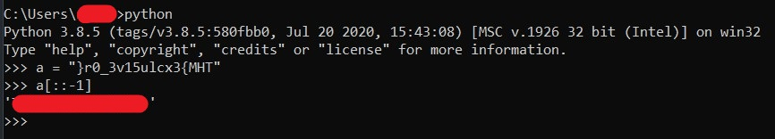

### [TASK 15] Binary walk

Please exfiltrate my file :)

> Run `binwalk -e hell.jpg`. You will see there is file called `hello_there.txt`

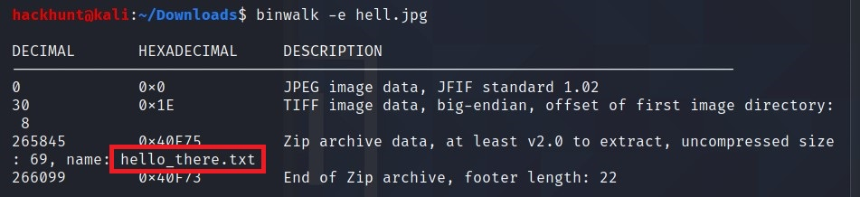

A new folder is created `_hell.jpg.extracted`. Check the file.

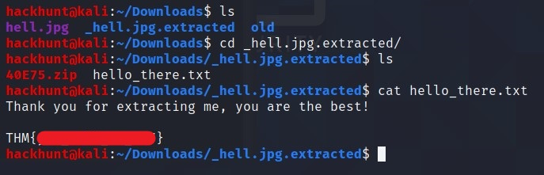

### [TASK 16] Darkness

Download the tool called StegSolve, if haven't yet -> `wget http://www.caesum.com/handbook/Stegsolve.jar -O stegsolve.jar`

Make it executable -> `chmod +x stegsolve.jar`

Start the tool -> `./stegsolve.jar`

Click on File and load the image. Play with Arrow keys and you will get the flag.

### [TASK 17] A sounding QR

How good is your listening skill?

P/S: The flag formatted as THM{Listened Flag}, the flag should be in All CAPS

> Decode the QR as same before using https://zxing.org/w/decode.jspx. Go to the URL mentioned. Record the sound and play it with slow speed.

### [TASK 18]  Dig up the past
Sometimes we need a 'machine' to dig the past

Targeted website: https://www.embeddedhacker.com/
Targeted time: 2 January 2020

> Go to `archive.org`, search for the website open the snapshot of the time mentioned. Scroll Down to THM Flag article.

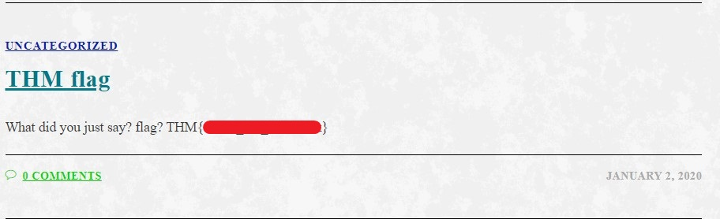

### [TASK 19]  Uncrackable!

Can you solve the following? By the way, I lost the key. Sorry >.<

MYKAHODTQ{RVG_YVGGK_FAL_WXF}

Flag format: TRYHACKME{FLAG IN ALL CAP}

> As the HINT says it is `vigenere cipher`. Go to [CyberChef][2] and choose vigenere decode. We are sure that before curly braces it is `TRYHACKME` so we can put that as a KEY and get the REAL Key.

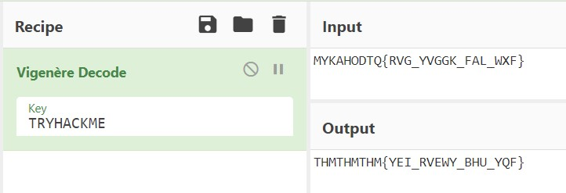

So from this we get that `THM` is the key as it is repeating.

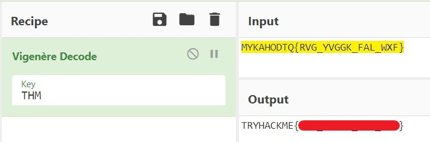

### [TASK 20] Small bases

Decode the following text.

581695969015253365094191591547859387620042736036246486373595515576333693

Use [RAPIDTABLES.COM][6] to convert `decimal` to `hex`

Then use that `hex` on convert to `ascii` from here -> https://www.rapidtables.com/convert/number/hex-to-ascii.html

### [TASK 21] Read the packet

I just hacked my neighbor's WiFi and try to capture some packet. He must be up to no good. Help me find it.

> Open the file in Wireshark. Go to `File > Export Object > HTTP`. You will a file named `flag.txt`. Click on the file and click on `Preview`. You got the flag.

[1]: https://tryhackme.com/room/ctfcollectionvol1
[2]: https://gchq.github.io/CyberChef/
[3]: https://www.hackhunt.in/2021/03/list-of-common-hex-headers.html
[4]: https://www.dcode.fr/brainfuck-language
[5]: https://toolslick.com/math/bitwise/xor-calculator
[6]:https://www.rapidtables.com/convert/number/decimal-to-hex.html
