# [Kenobi][1]
Walkthrough on exploiting a Linux machine. Enumerate Samba for shares, manipulate a vulnerable version of proftpd and escalate your privileges with path variable manipulation.

### [TASK 1] Deploy the vulnerable machine

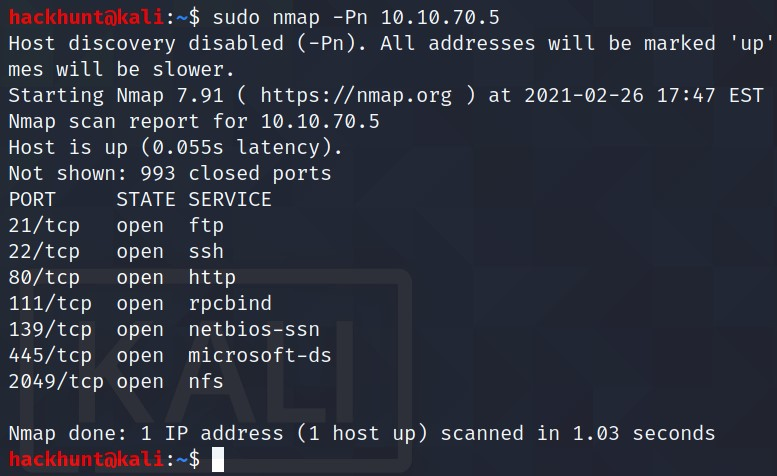

Scan the machine with nmap, how many ports are open? **7**

### [TASK 2] Enumerating Samba for shares

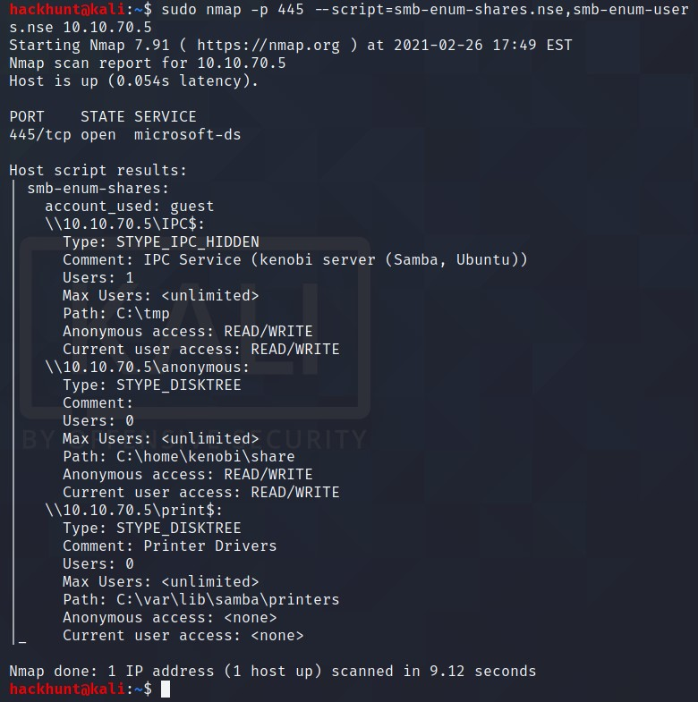

Using the nmap command above, how many shares have been found? **3**

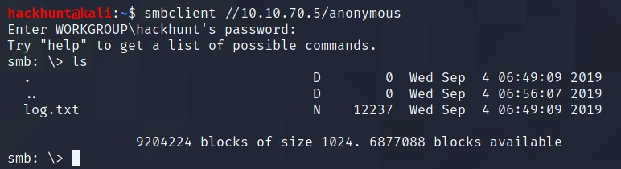

Once you're connected, list the files on the share. What is the file can you see? **log.txt**

> When asked for password, just hit enter.

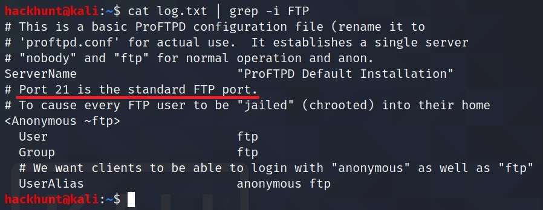

What port is FTP running on? **21**

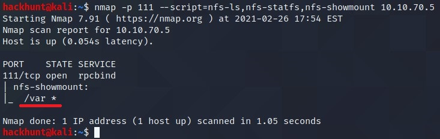

What mount can we see? **/var**

### [TASK 3] Gain initial access with ProFtpd

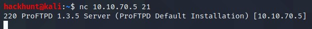

What is the version? **1.3.5**

> There are multiple ways to get the version number. Generally, people use `namp -sV -p111 10.10.70.5`. But sometimes connection to the server may also gives this information.

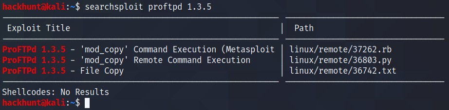

How many exploits are there for the ProFTPd running? **3**

Move the private key to /var/tmp folder.

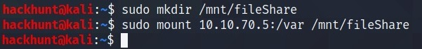

After mounting the drive get the ***id_rsa*** file and change its permission to use for SSH connection.

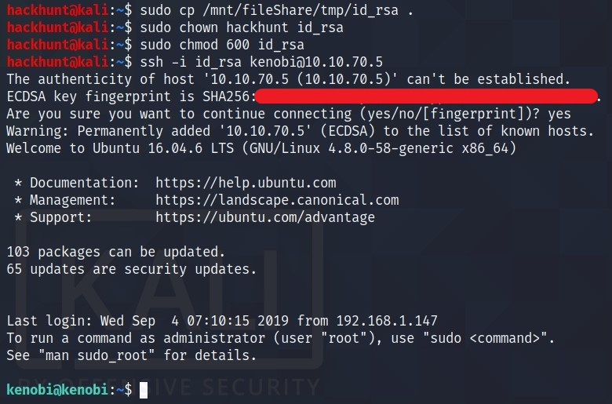

> Most of us do not have root access. So you need to use ***chown*** to change the permission from *root* to the current user. In my case *hackhunt* is the current user.

What is Kenobi's user flag (/home/kenobi/user.txt)?
> Now that we have access to the machine as *kenobi* user. We can do `cat user.txt` to get the flag.

### [Task 4]  Privilege Escalation with Path Variable Manipulation

> To find SUIDs on a system, run `find / -perm -u=s -type f 2>/dev/null`. To know more, [Click Here][2]

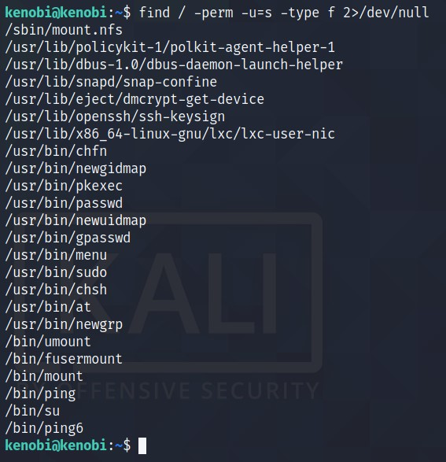

What file looks particularly out of the ordinary? **/usr/bin/menu**
> Menu command will give you the list of commands which can be run directly or through them.

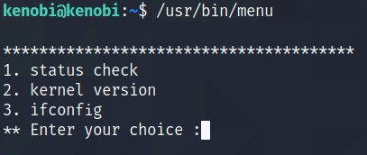

Run the binary, how many options appear? **3**

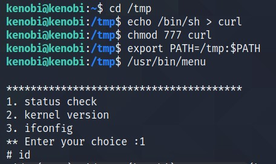

> What we are doing here is,
1. Creating a file called **curl** in the */tmp* directory and the content of the file is the content of */bin/sh* i.e. executable representation.
2. Making the file executable for all.
3. Adding */tmp* in the **$PATH** variable. Note that we are adding the */tmp* in the beginning of the PATH variable and appending the rest. As we want the system to find the first PATH for *curl* command in */tmp* directory.

This gives us the ***root*** access.

What is the root flag (/root/root.txt)?

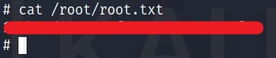

[1]: https://tryhackme.com/room/kenobi
[2]: https://www.hackingarticles.in/linux-privilege-escalation-using-suid-binaries/
