# [LazyAdmin TryHackMe Writeup/Walkthrough][1]
Easy linux machine to practice your skills

#### Scan the machine.
> If you are unsure how to tackle this, I recommend checking out the [Nmap Tutorials by Hack Hunt][2].

`nmap -sV -Pn <IP>`

Looks like we have two ports open: `22, 80`

Let's check the website.

> Hmm, looks like a default Apache Web page. I checked the source code nothing much there either.

I ran the `gobuster` to find directories -> `gobuster -u http://<IP> -w /usr/share/wordlists/dirb/common.txt`

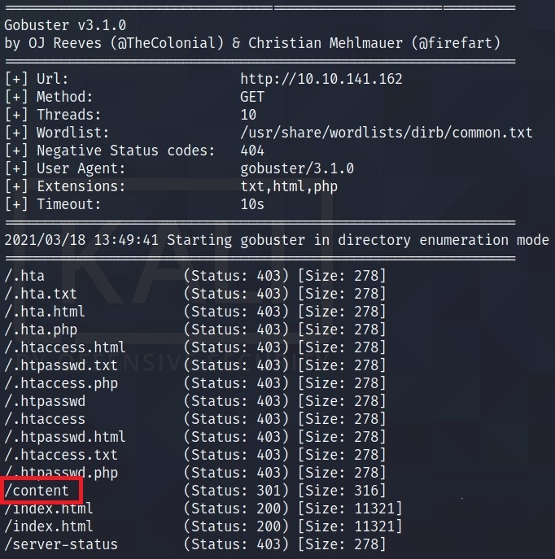
> One interesting result I found here was **/content**.

So, I went to `http://<IP>/content` and it looks like we have something here. I ran gobuster again -> `gobuster -u http://<IP>/content -w /usr/share/wordlists/dirb/common.txt`

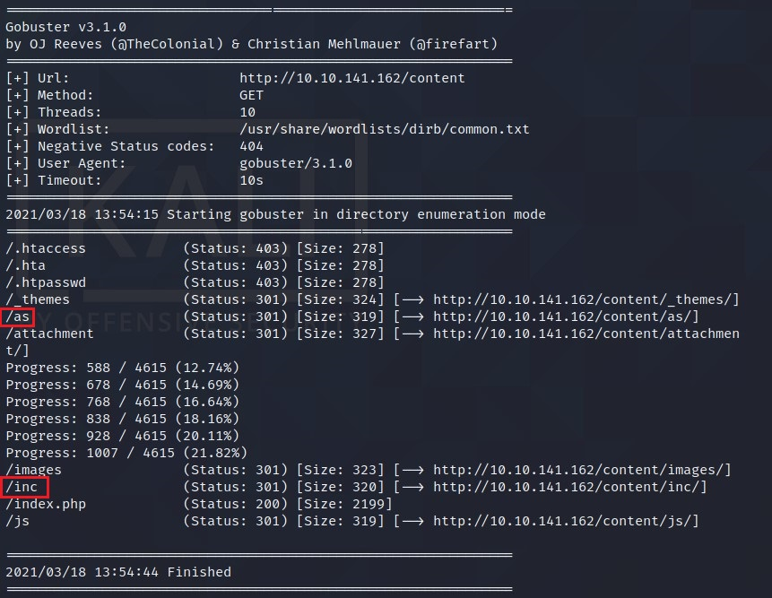

The interesting ones here are:
- /as
- /inc

`/as` is a login page. So, I check the `/inc` directory and I found some pretty interesting stuff.
- I got the version for the **SweetRice** from the file latest i.e. 1.5.1.
- I found a folder called `mysql_backup`. I checked the directory and there is a backup file. Let's check the content of the file.

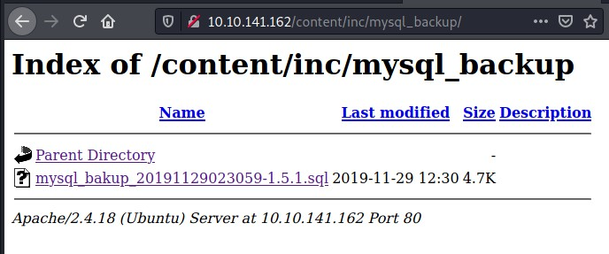

> I found a username and hashed password for the database.

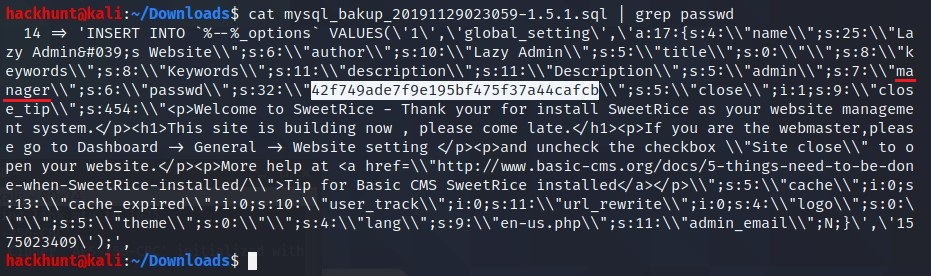

Next Stop, [Crackstation][3]! Paste the hash here.

Now, we have a username and password -> `manager:Password123`. Go to the login page.

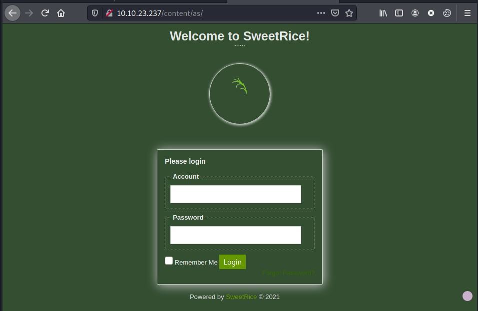
> Use credentials `manager:Password123` and you will get the access.

Meanwhile! When I was in a jam, I search for exploits for `sweet rice` on `searchsploit`

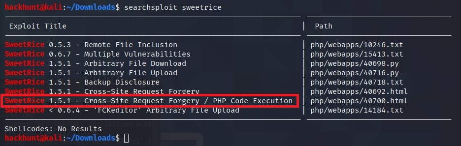
> As we have the Access to the admin's account. We can try CSRF. What more interesting is **CSRF + PHP**.

I copied the file to my current directory to make changes -> `cp /usr/share/exploitdb/exploits/php/webapps/40700.html 40700.html`

Open the file and change the IP address to the target machine's IP.

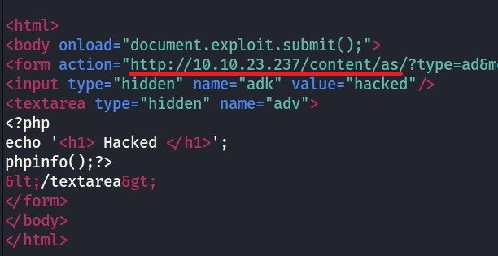
> After saving the file. Open the file and as its a CSRF it will automatically gives you a page to add **ADS**.

Paste the **PHP Reverse Shell Code** with you IP and PORT of your choice. (You can get the [Reverse Shell][4] from here)

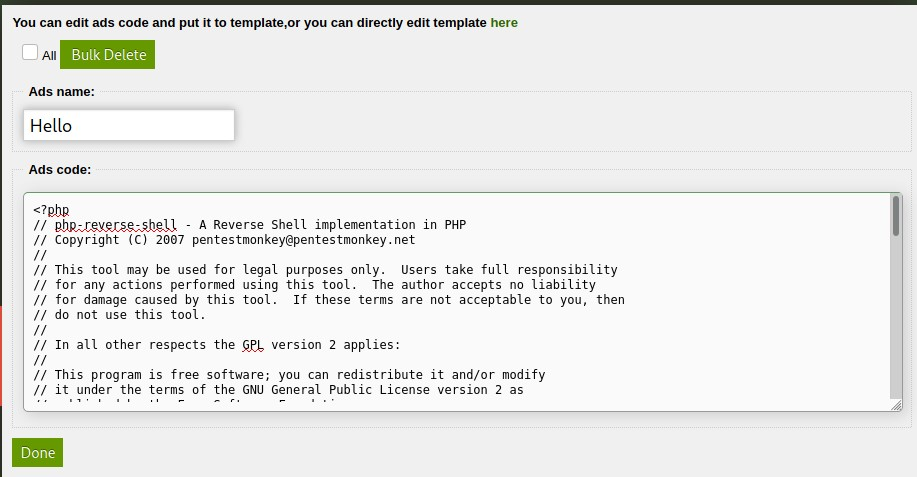
> Name anything you like, but do remember the name.

Click DONE and the file is uploaded. You will find the file in `/content/inc/ads`.

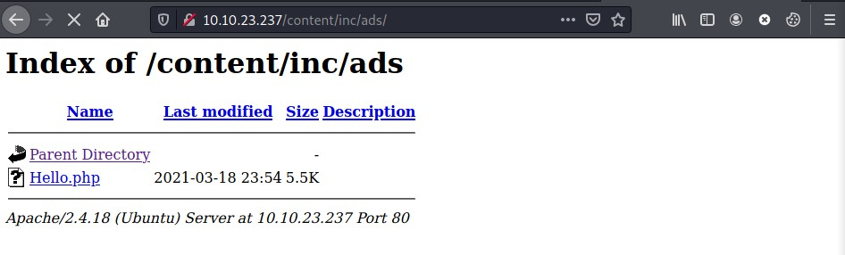

Before opening the file, start a listener using `nc -lvnp <PORT>`

Now open the file and you will see a successful connection.

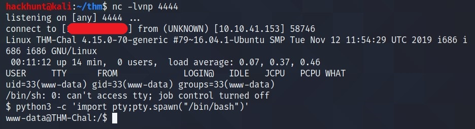
> The first thing I do is **SHELL STABLIZE**. This can be done using -> `python3 -c 'import pty;pty.spawn("/bin/bash")'`

As we have the access, now we can get the **user flag**. It is stored in the `home` directory.

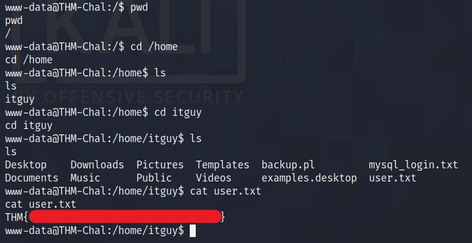

### Privilege Escalation

For enumeration, I start by doing `sudo -l` and check for SUIDs. Fortunately, there is a `perl` file which we can run.

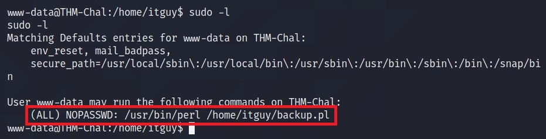

It seems like it is executing another file `/etc/copy.sh`.

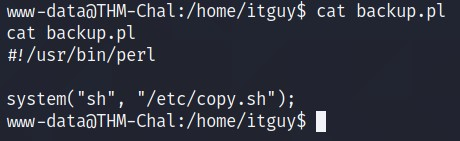

So, I checked the content and the permission of that file.

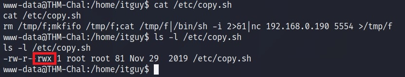
> As you can see that this file has write permission for all groups.

OSINT! I check for executing SHELL on [GTFOBins][5] for bash and found simple `bash` command can be used.

Now, we can append for change the content of the file to just `bash` ->  `echo "bash" > /etc/copy.sh`

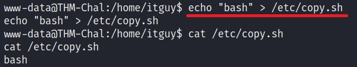

Run the backup file as we have the permission.

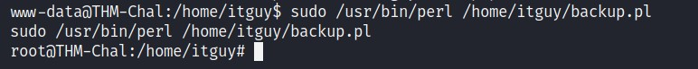
> BAAM! We got the root access.

You know what to do next :satisfied:

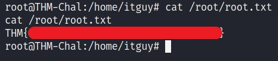

[1]: https://tryhackme.com/room/lazyadmin
[2]: https://www.hackhunt.in/search/label/Nmap
[3]: https://crackstation.net/
[4]: https://github.com/pentestmonkey/php-reverse-shell/blob/master/php-reverse-shell.php
[5]: https://gtfobins.github.io/gtfobins/bash/
