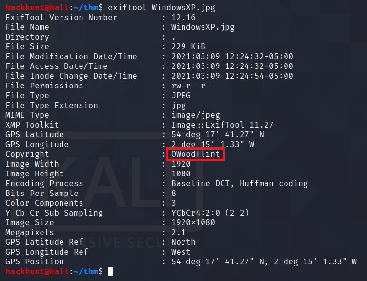
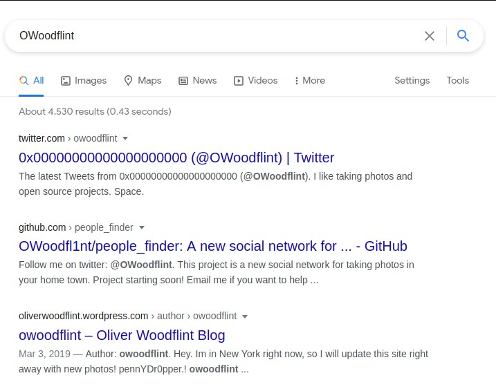
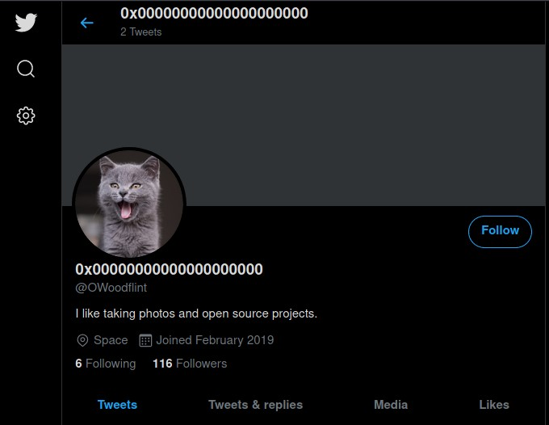
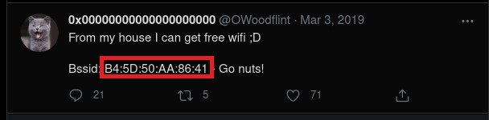
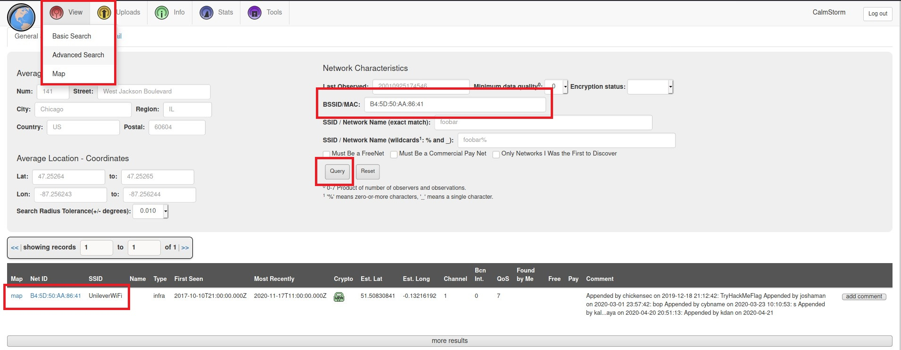
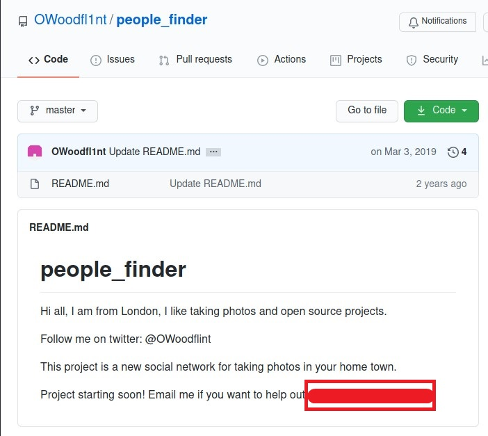
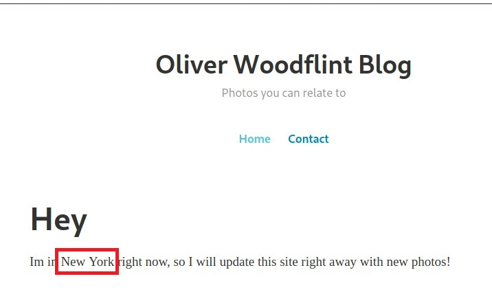
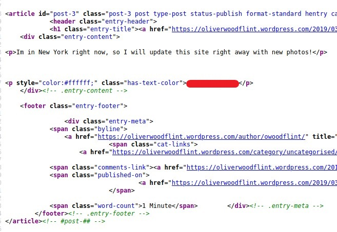

# [OhSINT][1]
Are you able to use open source intelligence to solve this challenge?

If you want to know more about Metadata like Importance of it, How to extract, Protection of Metadata or what Metadata really is check this article [Metadata by HackHunt][2].

Before answering the question, use `exiftool` mentioned in the [Extraction of Metadata by HackHunt][3].

From this result you can see the `Author` or `Copyright` is to someone named `OWoodflint`. When Googled, I found 3 links.

1. *What is this users avatar of?*

> Check the Twitter profile. The display picture.

2. *What city is this person in?*

The second post gives us `bssid` *(which is not very common)*

This can be used to search on `wigle.net` to get from information.
- Make sure to create an account
- Go to `View > Advance Search`
- Paste `bssid` and click on **Query**.
- Scroll down and click on **map**.

> Location is **London**

3. *Whats the SSID of the WAP he connected to?*

> From the above result we can get the SSID.

4. *What is his personal email address?*

> For this, go to the second link and you will find the information.

5. *What site did you find his email address on?*

> GitHub

6. *Where has he gone on holiday?*

> For this go to the third link i.e. the Blog. The place is **New York**

7. *What is this persons password?*

> Check the source code. There is something is white color after the statement in above picture.

[1]: https://tryhackme.com/room/ohsint
[2]: https://www.hackhunt.in/2021/03/metadata-explained.html
[3]: https://www.hackhunt.in/2021/03/extraction-of-metadata.html
