# [Simple CTF][1]

#### Scan the Machine
> If you are unsure how to tackle this, I recommend checking out the [Nmap Tutorials by Hack Hunt][2].

`nmap -sV -Pn <IP>`

Looks like we have three ports open: `21, 80, 2222`

*How many services are running under port 1000?*
> ***2***

*What is running on the higher port?*
> ***SSH***

- Checked the website, nothing much.

- Checked `robots.txt`, found some details. I think I found a username. Will investigate later.

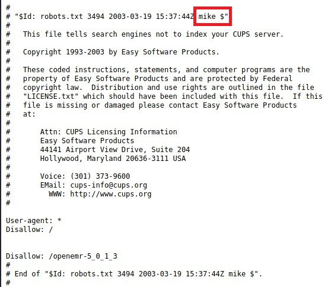

- Run GoBuster -> `gobuster dir http://<IP> -w /usr/share/wordlists/dirb/common.txt`

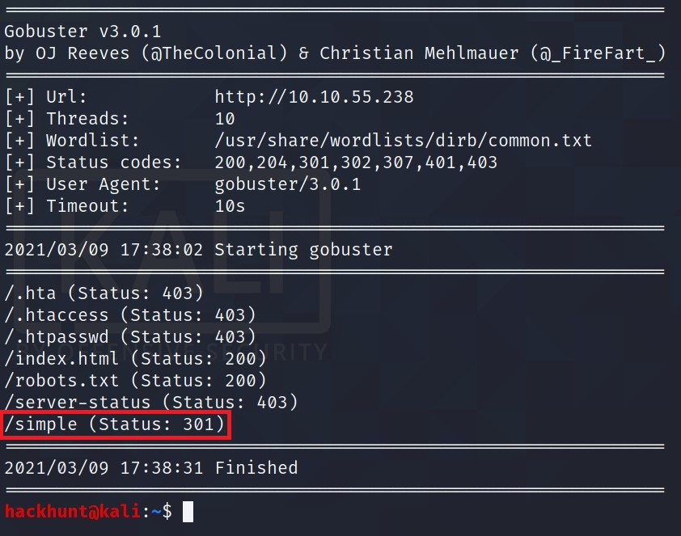

> There is one directory that catches my eye is `/simple`. So I checked the site `http://<IP>/simple`. Seems like ***CMS Made Simple*** Webpage. At the bottom there is version of it mentioned as well.

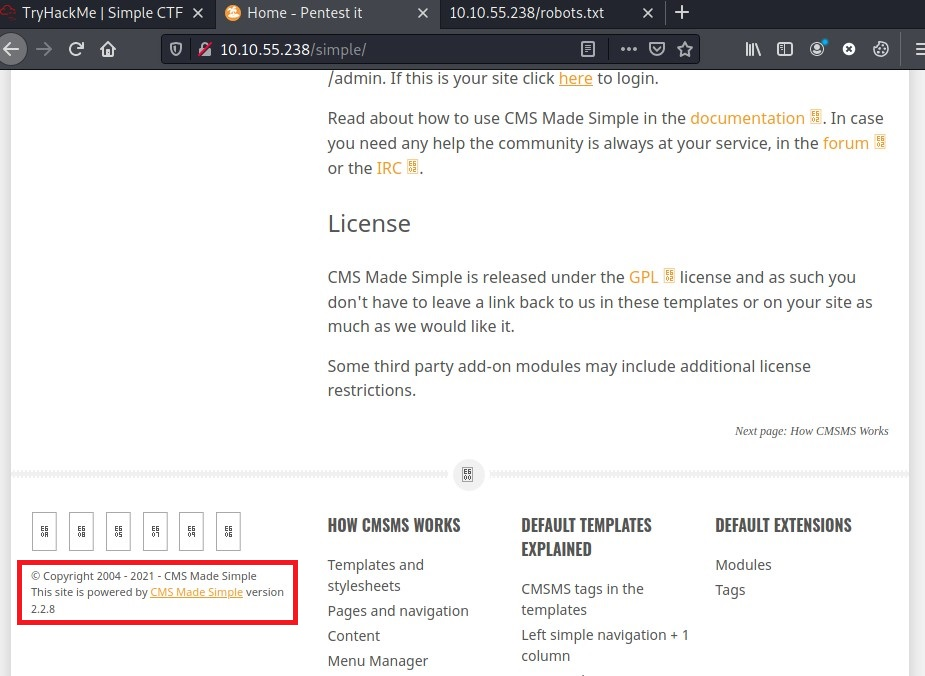

The `CMS made simple 2.2.8` can be searched on CVE Details website for vulnerability or `searchsploit` database can be used, CMD -> `searchsploit cms made simple 2.2.8`

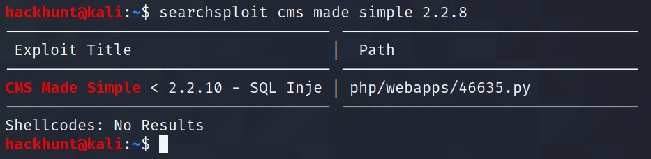
> Looks like we found an **SQL Injection** with this version and the exploit is located in `/usr/share/exploitdb/exploits/php/webapps/46635.py`

Check the file data to get the CVE number.

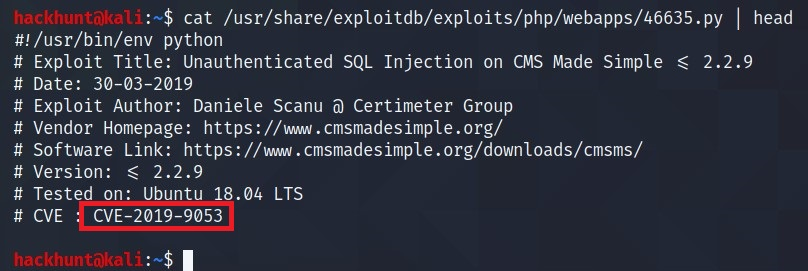

*What's the CVE you're using against the application?*
> ***CVE-2019-9053***

*To what kind of vulnerability is the application vulnerable?*
> ***SQLi***

Run the file -> `sudo python /usr/share/exploitdb/exploits/php/webapps/46635.py`

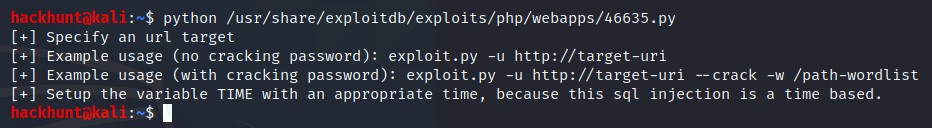

> If you have an error for *termcolor*.

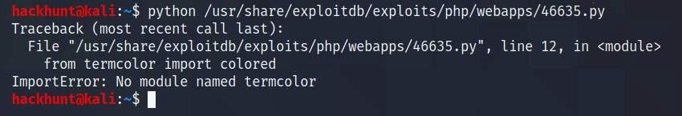

Download the **binaries** from the [Official Website][3]. Unzip the file using command `tar -xf <file_name>`. Change directory to the extracted folder and run `sudo python setup.py install`. This will solve your termcolor error.

Run the file with `sudo python usr/share/exploitdb/exploits/php/webapps/46635.py -u http://<IP>/simple --crack -w /usr/share/seclists/Passwords/Common-Credentials/best110.txt`

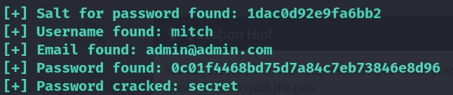

> The user credential is `mitch:secret`

*What's the password?*
> **secret**

As we know `ssh` is open. Let's try to connect -> `ssh mitch@<IP> -p 2222`

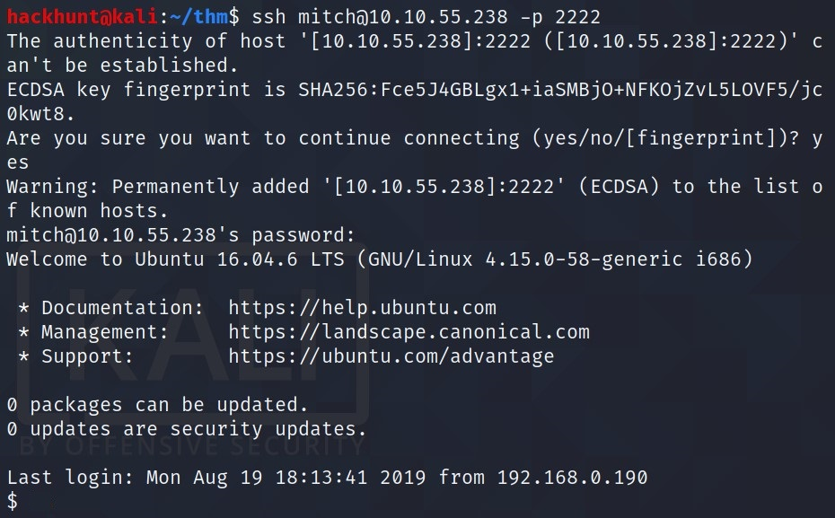

*What's the user flag?*

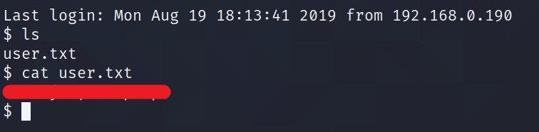

*Is there any other user in the home directory? What's its name?*
> ***sunbath***

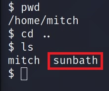

*What can you leverage to spawn a privileged shell?*
> ***vim***

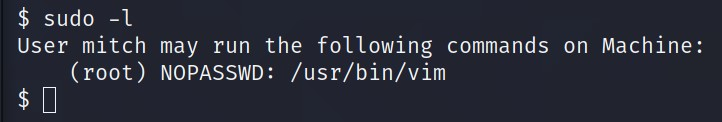

First let's make this shell stable by typing -> `python3 -c 'import pty;pty.spwan("/bin/bash")'`.

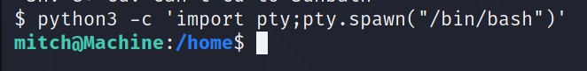

I searched online for privilege escalation for `vim` and I got a link from [GTFOBins][4].

Run the commands.

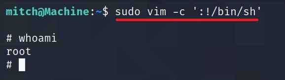

*What's the root flag?*

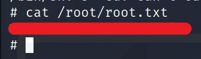

[1]: https://tryhackme.com/room/easyctf
[2]: https://www.hackhunt.in/search/label/Nmap
[3]: https://pypi.org/project/termcolor/#files
[4]: https://gtfobins.github.io/gtfobins/vim/
