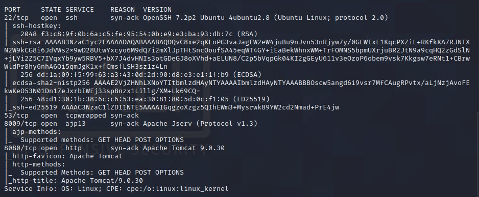
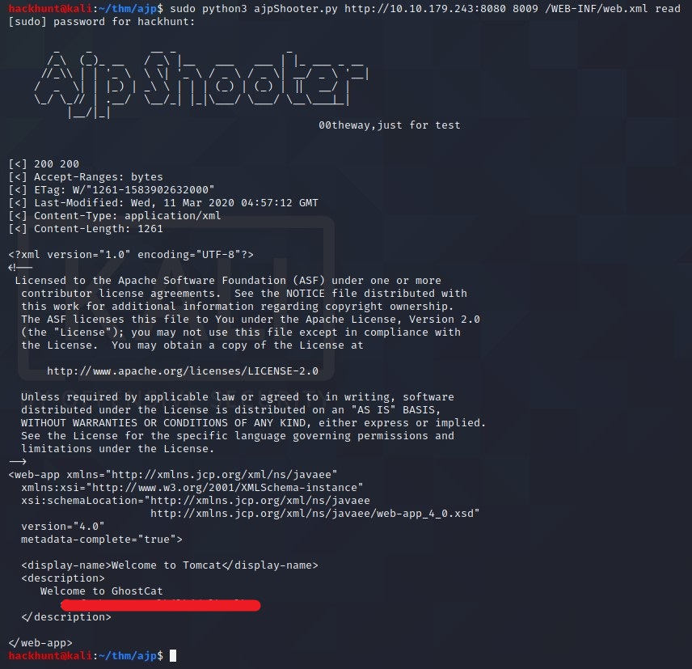
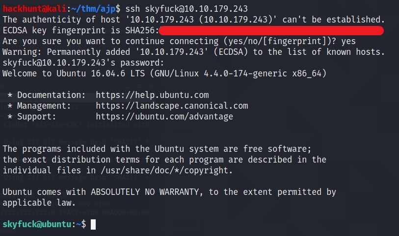
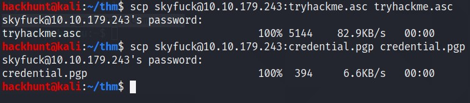
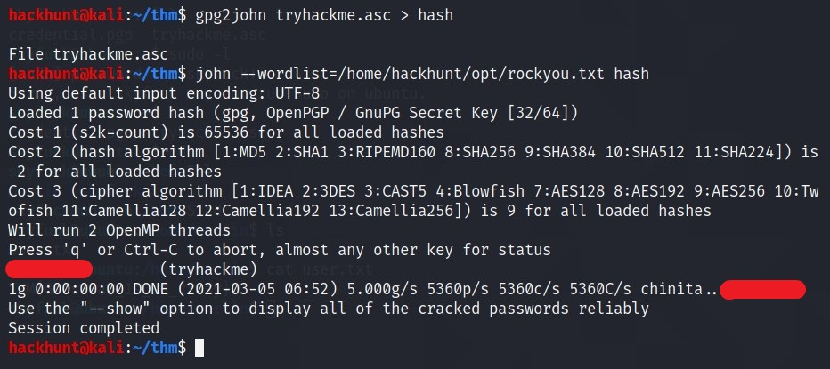
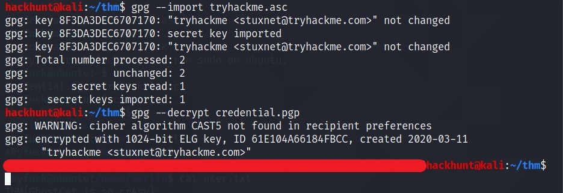
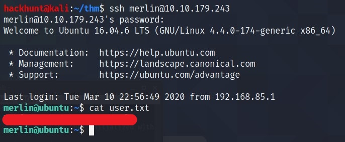
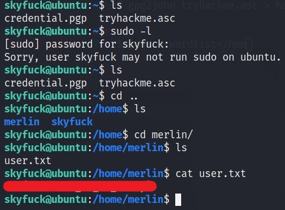
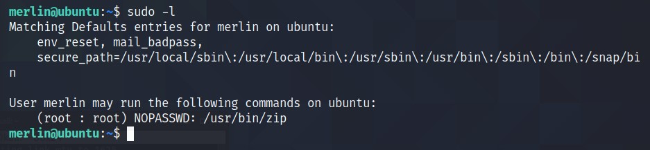
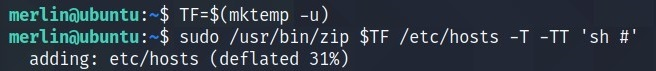

# [tomghost][1]
Identify recent vulnerabilities to try exploit the system or read files that you should not have access to.

#### Scan the machine.
> If you are unsure how to tackle this, I recommend checking out the [Nmap Tutorials by Hack Hunt][2].

`nmap -sV -Pn <IP>`



Looks like we have four ports open: `22, 53, 8009, 8080`

Let's check `port 8080` in browser. Nothing much there.

> Port `8009` seems interesting. Let's check for vulnerabilities to exploit via `ajp13`. Via simple Google Search, I came across GitHub Repo -> [Ghostcat-CNVD-2020-10487][3].

Clone the Repo and run the program on the given IP `python3 ajpShooter.py http://<IP>:<PORT> <AJP_PORT> /WEB-INF/web.xml read`.



BOOM! Got `username:password`. Let's connect via SSH.



> We got two file -> `credential.pgp` and `tryhackme.asc`. A simple Google Search `What can I do with .asc and .pgp file` says ***asc*** file is used to decrypt ***pgp***. Let's get this file on our system using `scp`.




So when I tried to import the *.asc* file. It requires a passpharse. No Worries, JohnTheRipper to RESCUE.


> We convert `.asc` to Hash format suitable for JohnTheRipper -> `gpg2john tryhackme.asc > hash`. Then Bruteforce using John and wordlist `rockyou.txt`

Now try to import the file again with this passpharse.



BAAM!! ***Merlin's*** password. Let's SSH via merlin.


> We have user.txt flag.

***HEADSUP!*** You could have get the user flag via skyfuck's SSH (at least this is the way I got it).



Check what privileges' merlin have using `sudo -l` cmd.


> Looks like we have access to run `zip` command. Google Search -> *Privilege Escalation via ZIP*. GTFObins looks promising. Run those commands.

```
TF = $(mktemp -u)
sudo zip $TF /etc/host -T -TT 'sh #'
```


> We got the ROOT access.


[1]: https://tryhackme.com/room/tomghosts
[2]: https://www.hackhunt.in/search/label/Nmap
[3]: https://github.com/00theway/Ghostcat-CNVD-2020-10487
